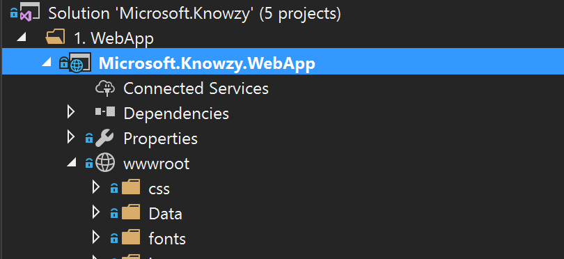

# Task 1.1.1 - Build a Responsive Web App

## Prerequisites 

You will need [Visual Studio 2017](https://developer.microsoft.com/windows/downloads).

Begin by downloading the codebase for the webapp, go to the git repo [https://github.com/Knowzy/KnowzyInternalApps](https://github.com/Knowzy/KnowzyInternalApps) and clone or download the content onto your local computer.

## Task 
### Make your website responsive.
  Most of the work has already been done to make sure that your site works well across different devices, but you will need to make a few adjustments to the code base to ensure that it flows properly for screens of all sizes.  You should also make sure that the webapp works across platforms, since some of the Knowzy contractors carry Android tablets instead of Windows 10 devices.

  You should have the code repo on your local device. Open the folder `\src\Knowzy_Shipping_WebApp` and run your web site locally by double-clicking the "Microsoft.Knowzy" Visual Studio file to see the webapp project that you are starting with.

<!--   Would be helpful to identify specifically which components of the Hack Checklist need to be on your machine in order to build this project locally / complete this tutorial as everyone may not want to install all of the Hack Checklist components. (I don't) Is this only the ASP.Net web dev component? -->
  
  1. Open up your site.css file at the following path:
        
        \wwwroot\css\site.css

    and find the following declaration toward the top of the page:

        .container-main {
            width: 800px;
            padding-right: 15px;
            padding-left: 15px;
            margin: 0 auto;
        }

2. Add a declaration for the "container-main" class inside of a media query. Media queries resize the page properly for different screen sizes. You will want to create media queries with style declarations for the screen sizes of 320px, 768px, 992px, and 1200px like below:

        @media all and (min-width:320px) {
            .container-main {
                width: 100%;
            }
        }

        @media all and (min-width:768px) {
            .container-main {
                width: 750px;
            }
        }

        @media all and (min-width:992px) {
            .container-main {
                width: 970px;
            }
        }

        @media all and (min-width:1200px) {
            .container-main {
                width: 1170px;
            }
        }

    Be sure to add these rules *below* the "container-main" rule, so the media queries will override the width of the main rule.

3. View your web app in a browser (you can do this  by hitting F5 in visual studio or clicking on the start button), and adjust the width of your window to test responsiveness of the design.  If you have a tablet device, you can change the orientation of your device to make sure that the page response properly.  

<!--   It should look similar to this...

  IMAGES STILL NEEDED
 [image of page layout on two different orientations] -->
 
 
Your app is now ready to be viewed on devices with different screen sizes and orientations.

### Deploy your ASP.net App Changes
Now that you have these powerful new features running locally, you can publish them to your website on Azure.

1. In Visual Studio select the "Microsoft.Knowzy.WebApp" in the solution explorer, then choose Build > Publish... 
**NOTE** some configurations of Visual Studio may have the "publish" option as its own menu.

    

2. Choose "Microsoft Azure App Service" from the selection screen

    

3.  Choose a name for your new site and other configurations.  This can be published as a free site.

    

4. Keep track of the new URL you have created, you'll want to use this later.

5. Hit "create" and wait for your web app to finish deploying.

## References

- [Knowzy App GitHub Repo](https://github.com/Knowzy/KnowzyInternalApps)

## Continue to [next task >> ](112_GeneratePWA.md)
