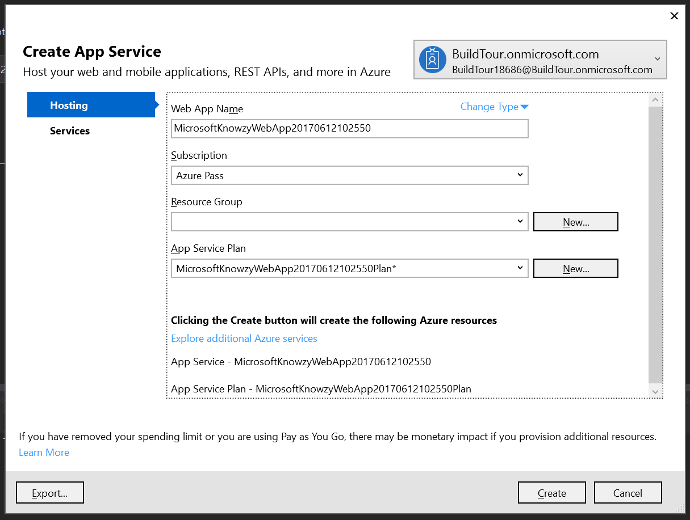

# Task 1.1.1 - Build a Responsive Web App

## Prerequisites 

your developer build should include Visual Studio 2017.. 
You'll need to start by downloading the codebase for the webapp.   

To do this, go to the git repo ####### and clone the content onto your local computer.


## Task 
### Make your website responsive.
  Most of the work has already been done to make sure that your site works well across different devices, but you'll need to make a few adjustments to the code base to ensure that it flows properly for screens of all sizes.  You'll also want to make sure that it works across platforms, since some of the Knowzee contractors carry Android tablets instead of Windows 10 devices.
  
  1. Open up your site.css file at the following path:
```
\wwwroot\css\site.css
```

 and find the following declaration toward the top of the page:

```
.container-main {
    padding-right: 15px;
    padding-left: 15px;
    margin: 0 auto;
    width: 400px;
}
```




  2. Add a declaration for "container-main" inside key media queries to resize the page properly for different screen sizes. You'll want to add it for the key screen sizes of 320px, 768px, 992px, and 1200px like below:

```
@media all and (min-width:320px) {
    .container-main {
        width: 100%;
    }
}

@media all and (min-width:768px) {
    .container-main {
        width: 750px
    }
}

@media all and (min-width:992px) {
    .container-main {
        width: 970px
    }
}

@media all and (min-width:1200px) {
    .container-main {
        width: 1170px
    }
}
```

  Be sure to add these rules *below* the "container-main" rule, so the media queries will override the width of the main rule.

  3. View your web app in a browser, and adjust the width of your window to test responsiveness of the design.  If you have a tablet device, you can change the orientation of your device to make sure that the page response properly.  It should look similar to this
 [image of page layout on two different orientations]
 
 
Your app is now ready to be viewed on devices with different screen sizes and orientations.


### Deploy your ASP.net App Changes
Now that you have these powerful new features running locally, you can publish them to your website on Azure.

1. In Visual studio choose Project > Publish...

2. Choose "Microsoft Azure App Service" from the selection screen



3.  Choose a name for your new site and other configurations.  This can be published as a free site.



4. hit "create" and wait for your web app to finish deploying.



## References










