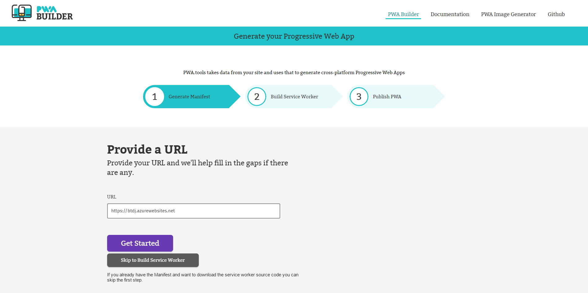
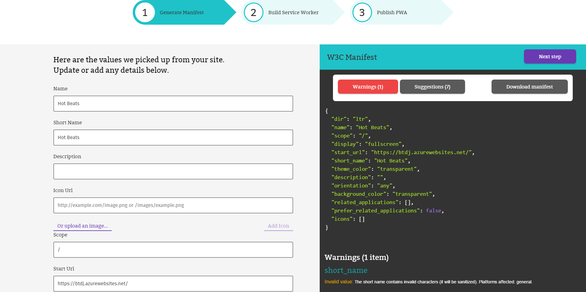
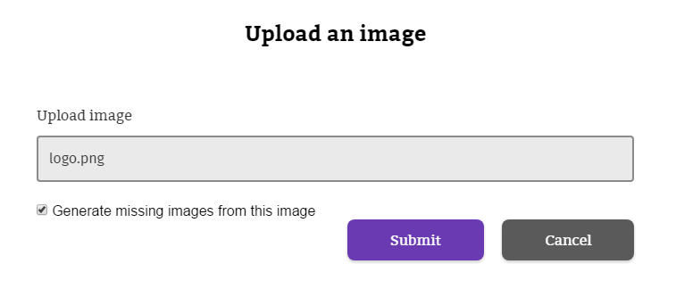
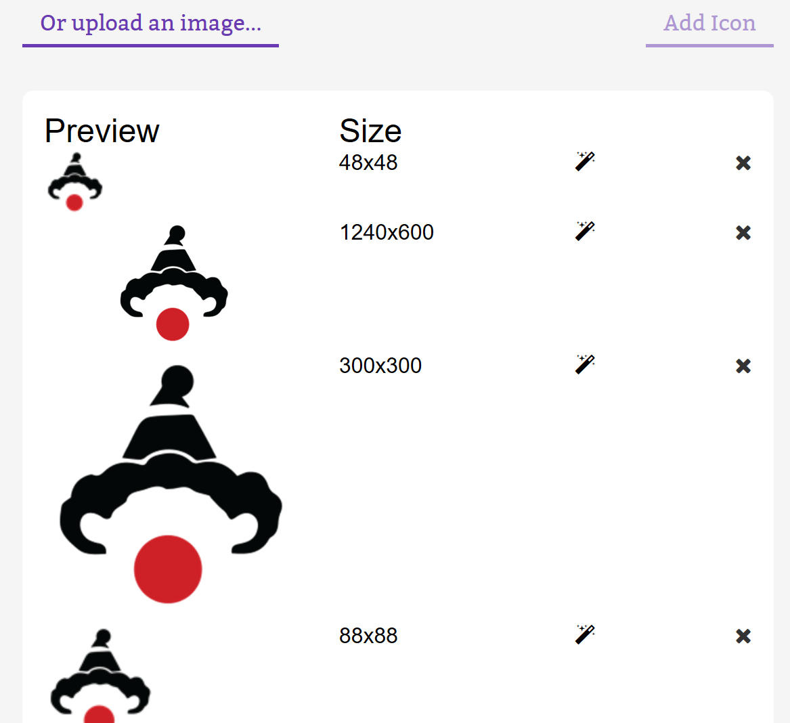
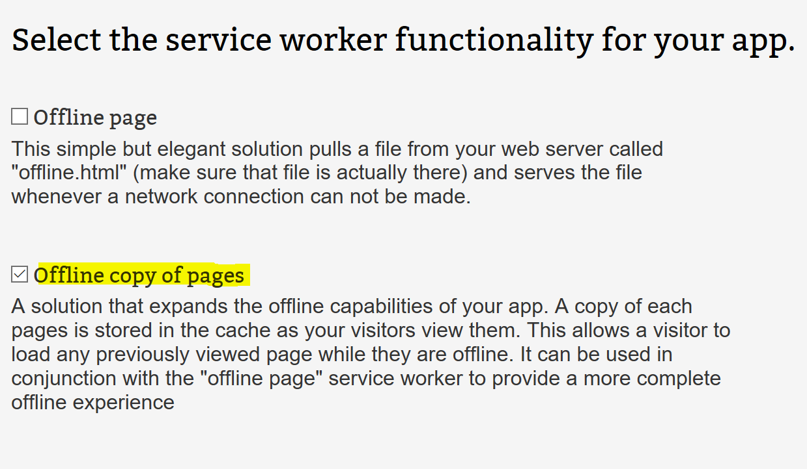

# Task 1.1.2 - Generate Progressive Web App

## Prerequisites 

This task has a dependency on [Task 1.1.1](111_BuildWebApp.md) and all of it's prerequisites


## Task 

The first step is to build the Manifest for your application using the **pwabuilder.com** web site. The builder will search in the home page of your site looking for information about the app in specific meta tags. For more information, read [What is a Manifest](http://docs.pwabuilder.com/whatPWA/what-is-a-manifest/).

### Provide a URL 

1. Open a browser and navigate to [https://preview.pwabuilder.com](https://preview.pwabuilder.com)
2. Click on the **Get Started** button 
3. In the URL textbox, enter the https version of your URL of your site and click on **Get Started** again 
**Note** your website URL will likely default to the http version in the browser but all azure websites also have a valid https certificate so https can be used on any azure website.

 

### Generate Manifest 
The builder will search in the home page of your site looking for an existing manifest. If not, it will gather information about the app in specific meta tags or propose default values for the manifest properties. It will also show any warnings or suggestions to address potential issues in the collected metadata. Make sure you address any warnings before you move on. 

 


### Add Images 
The builder site also checks whether the manifest has defined the expected icon sizes for the different platforms (Windows, Android, iOS) and helps to generate the missing sizes. You can also generate missing image sizes for other platforms using the [PWA Image Generator](http://appimagegenerator-pre.azurewebsites.net/). 

1. For our side, we don't have any image defined in the manifest so we'll proceed uploading an image with our app logo. To do this, click on the **Upload an image…** link at the left pane. 

2. Save the below Knowzy logo to your PC by right clicking and "save image as".

  

2. Browse to the location of the image you downloaded and if you want to generate the missing sizes, make sure the **Generate missing images from this image** checkbox is marked. 

**Note:** The **Upload image** option will generate the required image sizes for Windows 10, and suggested images for other platforms.

  

3. Click **Submit**. In our example, the missing image sizes are automatically generated and added to the manifest.

  

4.  Click "download manifest" to get a copy of this manifest to add to your web site.


## Choose a Service Worker
During this step you will choose functionalities you want to add to your app. The builder will include code to use sample service workers implementing those features from a repository. Learn more about service workers [here](http://docs.pwabuilder.com/whatPWA/what-is-a-service-worker/). There are a number of service workers to choose from on this page, but Knowzy is looking for a way to make sure it's field agents can access the app data when they have poor or no network connection.  For this functionality we'll choose the "Offline copy of pages" service worker.

1. Select the service worker you want to include in your application  

2. Download the service worker package including the code for your website and the service worker code (you can also just copy and past the code right from the site).  You'll be downloading two different js files.  The first is the registration code in which you'll be instructed how to add that to your site in the next section, and the service worker itself.  



## References

















