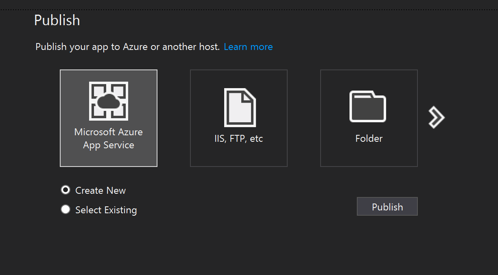

# Task 1.1.3 - Update your Web App with PWA features

## Prerequisites 

This task has a dependency on [Task 1.1.2](112_GeneratePWA.md) and all of it's prerequisites

## Task 

###  Add Web App Manifest to your site

The first thing you'll need to do is pull the "manifest.json" file and the "images" folder that you obtained from the zip file. in the previous step.

1. Add the manifest.json and the "images" folder to the root path of your site (wwwroot).  Remember if you change the path of your "images" folder, you need to update the json in your manifest file to reflect your changes. 

![add image of manifest and paths ]

2. Reference the manifest in your page with a link tag:

	````
	<link rel="manifest" href="manifest.json"></link>
	````
This can be done by opening the "index.cshtml" page in your site, and adding the following to the top of the document:

```

@section HeadExtension{ 
<link rel="manifest" href="manifest.json" />
}

```

### Add SW code to your site

Your Service Worker needs likewise needs to be added to your site to take effect.  

1. Copy the "pwabuilder-sw.js" file from the zip you downloaded from the service worker page of PWA Builder and add it to your js folder in wwwroot > js

<!--

2.  You will then want to add a short "time to live" for your manifest file so it can be updated often.  To do this you will need to add the following block of code to

!!!!!!!!!!!!!!!!!!!!!!!how do you sent a short expiration on this file"!!!!!!!!!!!!!!!!?????????????

-->

2. Open up the landing page of your app (index.cshtml) and create a new script tag in the head also wrapped in a HeadExtension section like so:

```
@section HeadExtension{ 
<script></script>
}


```
You will want to place this at the top of your document.


3. Add the following registration code inside the new script tag:

```
//This is the service worker with the combined offline experience (Offline page + Offline copy of pages)

//Add this below content to your HTML page, or add the js file to your page at the very top to register service worker
if (navigator.serviceWorker.controller) {
  console.log('[PWA Builder] active service worker found, no need to register')
} else {

//Register the ServiceWorker
  navigator.serviceWorker.register('js/pwabuilder-sw.js', {
    scope: './'
  }).then(function(reg) {
    console.log('Service worker has been registered for scope:'+ reg.scope);
  });
}

```

### Generate json pre-cache file for service worker

You now have to generate a array of the files that you would like to be pre-cashed to make your site faster.  We'll add our data files as well so that our app will work entirely offline.

1. create a new file inside your root called "pwab-config.json".

2. Copy and past the following JSON object into the new file

```
{}
```
3. So we make sure this file is checked for the latest content, set a file life of XXXXXXXXXXXXXX.

### Publish Changes

Now that you have these powerful new features running locally, you can publish them to your website to be consumed as a PWA.

1. In Visual studio choose Project > Publish...

2. Choose "Microsoft Azure App Service" from the selection screen



3.  Choose a name for your new site and other configurations.  This can be published as a free site.


4. hit "create" and wait for your web app to finish deploying.


## References


