# Task 2.1.1 - Add Desktop Bridge Support using Visual Studio 2017

This task will guide you through the process of converting an existing Win32 Desktop app to a Desktop Bridge UWP App using Visual Studio 2017. 
There are a lot of steps to correctly setup Visual Studio 2017 to build and package your Win32 App as a UWP app. Each update of Visual Studio 2017 had made this process easier. 
Future updates to Visual Studio 2017 will most likely add Desktop Bridge project templates that will automate this process. Until then, please follow this steps carefully.


## Prerequisites 

* Basic knowledge of C# development
* Basic knowledge of client development with the .NET framework
* Basic knowledge of Windows 10 and the Universal Windows Platform
* A computer with Windows 10 Anniversary Update or Windows 10 Creators Update. If you want to use the Desktop App Converter with an installer, you will need at least a Pro or Enterprise version, since it leverages a feature called Containers which isn’t available in the Home version.
* Visual Studio 2017 with the tools to develop applications for the Universal Windows Platform. Any edition is supported, including the free [Visual Studio 2017 Community](https://www.visualstudio.com/vs/community/)
* Go to the git repo at https://github.com/Microsoft/BuildTourHack and clone or download the content onto your local computer.


## Task: Add Desktop Bridge support in Visual Studio


#### Step 1: Open the existing Knowzy Win32 Solution with Visual Studio 2017

We will be converting an exiting WPF application from Win32 to UWP. To get started, please open the **Microsoft.Knowzy.WPF.sln** in the **BuildTourHack\src\Knowzy_Engineering_Win32App** folder with Visual Studio 2017.

Set the Microsoft.Knowzy.WPF project as the startup project. Press F5 to build and run the project. Feel free to try out the application and then quit the application and return to Visual Studio.


#### Step 2: Add a UWP Project

To create a Desktop Bridge package, first add a C# Windows Universal Blank App project to the your solution.

* Right-click on the **src** folder in the Solution and select **Add | New Project...**


* Select the **Visual C# | Windows Universal | Blank App (Universal Windows)** project template. 
* Name the project **Microsoft.Knowzy.UWP**. 
* Make sure you save the project to the **Knowzy_Engineering_Win32App\src** directory.

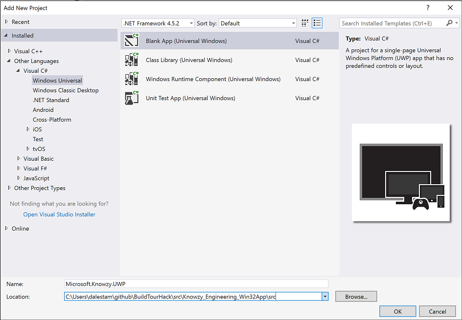

Make sure the minimum Windows SDK version is **14393** or higher. Windows 10 14393 or higher is required for Desktop Bridge apps.

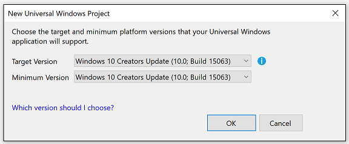

You solution should now contain the following projects.

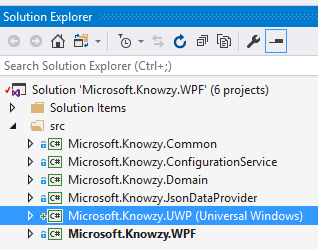

* Add a Project Dependency to Microsoft.Knowzy.WPF. Right click on the Microsoft.Knowzy.UWP project

* Select **Build Dependencies | Project Dependencies..."**

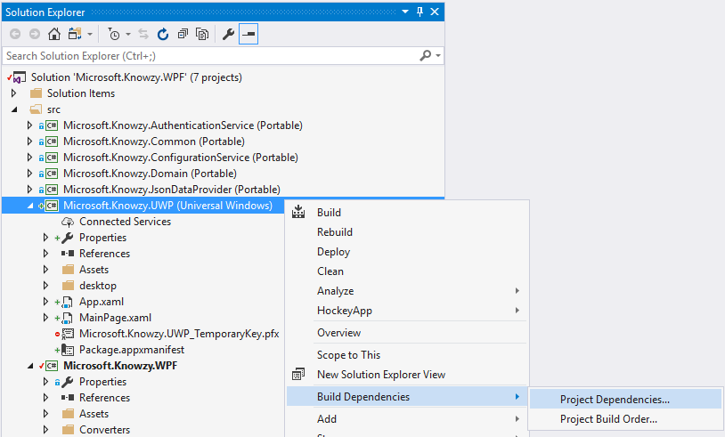

* Select the Microsoft.Knowzy.WPF project and click **OK**


Press F7 (or whatever your Build Solution shortcut key is) to build the Solution. To see what an empty C# UWP app looks like:

* Right click on the Microsoft.Knowzy.UWP project and select **Debug | Start new instance ** to run the UWP app.
* An empty UWP app window will appear. Close the window to return to Visual Studio 2017.


#### Step 3: Add the  Microsoft.Knowzy.WPF binaries to the UWP Project

In order to convert the Microsoft.Knowzy.WPF app to a Desktop Bridge UWP app, you will need to add the binaries created by the Microsoft.Knowzy.WPF app to the Microsoft.Knowzy.UWP app. 
We are going to use the Microsoft.Knowzy.UWP project to create the AppX package that will eventually be submitted to the Windows Store. In later tasks, we will also use the Microsoft.Knowzy.UWP
project to add UWP features to our converted Microsoft.Knowzy.WPF app.

All the Win32 binaries created by the Win32 Microsoft.Knowzy.WPF project need to be copied to your UWP project to a folder called desktop (this exact name is not required; you can use any name you like).
You can automate the Microsoft.Knowzy.WPF project to copy these files after each build, improving the development workflow. We are going to edit the project file Microsoft.Knowzy.WPF.csproj
to include an AfterBuild target that will copy all the Win32 output files to the desktop folder in the Microsoft.Knowzy.UWP project as follows:

```xml
  <Target Name="AfterBuild">
    <PropertyGroup>
      <TargetUWP>..\Microsoft.Knowzy.UWP\desktop\</TargetUWP>
    </PropertyGroup>
    <ItemGroup>
      <DesktopBinaries Include="$(TargetDir)\**\*.*" />
      <ExcludeFilters Include="$(TargetDir)\**\*.winmd" />
    </ItemGroup>
    <ItemGroup>
      <DesktopBinaries Include="$(TargetDir)\**\*.*" />
    </ItemGroup>
    <ItemGroup>
      <DesktopBinaries Remove="@(ExcludeFilters)" />
    </ItemGroup>
    <Copy SourceFiles="@(DesktopBinaries)" DestinationFiles="@(DesktopBinaries->'$(TargetUWP)\%(RecursiveDir)%(Filename)%(Extension)')" />
  </Target>
```

This rather complicated bit of XML completes several important tasks:

* TargetUWP specifies where to copy the Win32 binaries. In this example, the binaries will be copied to the desktop folder in the Microsoft.Knowzy.UWP project folder.
* The files will be copied preserving their directory structure by specifying %(RecursiveDir)%(Filename)%(Extension) in the Copy tag
* Any .winmd files in the Microsoft.Knowzy.WPF output folder will not be copied to the output directory. This is specified with the ExcludeFilters tag.
* all of the DLL dependcies of the Microsoft.Knowzy.WPF exe (including the ones from the NuGet packages) will be copied to the output directory.


You can edit the XML of the Microsoft.Knowzy.WPF.csproj in Visual Studio by right-clicking on the project and selecting **Unload project**

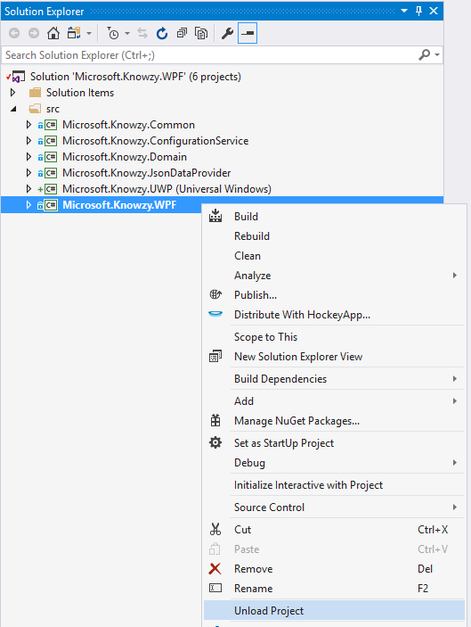

Right-click again on Microsoft.Knowzy.WPF.csproj and select **Edit MyDesktopApp.csproj**

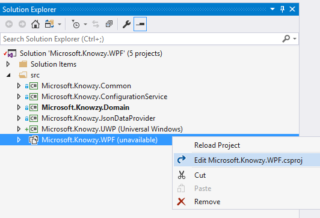

Scroll to the end of the xml file and paste the above xml code to the end of the file before the final project tag.
Save your changes and then reload Microsoft.Knowzy.WPF

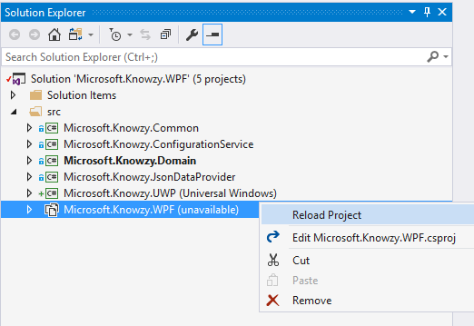

Rebuild the solution so the Microsoft.Knowzy.UWP project binaries will be copied to the Microsoft.Knowzy.UWP/desktop folder.

Now that the Win32 binaries are copied to the desktop folder in the Microsoft.Knowzy.UWP project after the build, we need to add the binaries to the UWP project so they will be packaged with the UWP app.
We can automate this process by editing the Microsoft.Knowzy.UWP.csproj project. Following the same procedure you just completed when editing the Microsoft.Knowzy.WPF.csproj file, 
you will unload, edit and reload the Microsoft.Knowzy.UWP.csproj project file. Add the following XML to the end of the Microsoft.Knowzy.UWP.csproj project file.

```xml
  <ItemGroup>
    <Content Include="desktop\**\*.*">
      <Link>desktop\%(RecursiveDir)%(FileName)%(Extension)</Link>
      <CopyToOutputDirectory>PreserveNewest</CopyToOutputDirectory>
    </Content>
  </ItemGroup>
```

This segment of XML completes several important tasks:

* All of the files in the desktop folder will be packaged with the UWP app
* The files will be copied to the AppX preserving their directory structure by specifying %(RecursiveDir)%(Filename)%(Extension) in the Link tag
* This process will be automated with every build of the solution.

Reload the Microsoft.Knowzy.UWP.csproj and build the solution. 

* Verify that the src\Microsoft.Knowzy.UWP folder contains a desktop folder. If the folder is missing, close and reopen the Microsoft.Knowzy.WPF.sln.
* You should be able to run the src\Microsoft.Knowzy.UWP\desktop\Microsoft.Knowzy.WPF.exe app by navigating to the folder and double-clicking on Microsoft.Knowzy.WPF.exe. This will test that all of the dependencies for Microsoft.Knowzy.WPF.exe were copied correctly to the desktop folder.

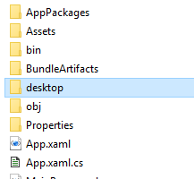


#### Step 4: Edit the Microsoft.Knowzy.UWP Package Manifest to enable the Desktop Bridge Extensions

The Microsoft.Knowzy.UWP project contains a file called Package.appxmanifest that describes how to package your UWP app and its dependencies for the Windows Store. 
The package manifest is an XML document that contains the info the system needs to deploy, display, or update a Windows app. This info includes package identity, 
package dependencies, required capabilities, visual elements, and extensibility points. Every UWP app package must include one package manifest.

We need to edit this file so it includes the infomation needed to run our Win32 WPF app as a UWP app. 

You edit the Package.appxmanifest xml file by right-clicking on the file in the Microsoft.Knowzy.UWP project and selecting **View Code**

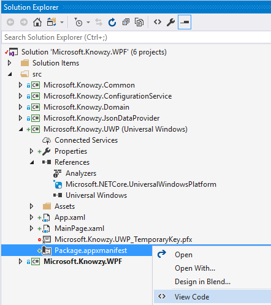

We will now edit the XML to add the DeskTop Bridge extensions. This will enable your Win32 app to run as a UWP app.

Replace the line (near line 7):

```xml
IgnorableNamespaces="uap mp">
```

with

```xml
xmlns:rescap="http://schemas.microsoft.com/appx/manifest/foundation/windows10/restrictedcapabilities" 
xmlns:desktop="http://schemas.microsoft.com/appx/manifest/desktop/windows10" 
xmlns:uap4="http://schemas.microsoft.com/appx/manifest/uap/windows10/4"
IgnorableNamespaces="uap mp rescap desktop">
```

Replace the line (near line 25):

```xml
    <TargetDeviceFamily Name="Windows.Universal" MinVersion="10.0.0.0" MaxVersionTested="10.0.0.0" />
```

with

```xml
    <TargetDeviceFamily Name="Windows.Desktop" MinVersion="10.0.14393.0" MaxVersionTested="10.0.14393.0" />  
```

Add the following capability to the Capabilities section (near line 49)

```xml
    <rescap:Capability Name="runFullTrust" />
```

Modify the Application tag to the following (near line 34):

```xml
    <Application Id="Knowzy" Executable="desktop\Microsoft.Knowzy.WPF.exe" EntryPoint="Windows.FullTrustApplication">
```


Your package.appxmanifest should now look something like:

```xml
<?xml version="1.0" encoding="utf-8"?>

<Package
  xmlns="http://schemas.microsoft.com/appx/manifest/foundation/windows10"
  xmlns:mp="http://schemas.microsoft.com/appx/2014/phone/manifest"
  xmlns:uap="http://schemas.microsoft.com/appx/manifest/uap/windows10"
  xmlns:rescap="http://schemas.microsoft.com/appx/manifest/foundation/windows10/restrictedcapabilities"
  xmlns:desktop="http://schemas.microsoft.com/appx/manifest/desktop/windows10"
  xmlns:uap4="http://schemas.microsoft.com/appx/manifest/uap/windows10/4"
  IgnorableNamespaces="uap mp rescap desktop">
  
  <Identity
    Name="9aed127a-4cd4-4b87-a6a6-4b63499a73cb"
    Publisher="CN=stammen"
    Version="1.0.0.0" />

  <mp:PhoneIdentity PhoneProductId="9aed127a-4cd4-4b87-a6a6-4b63499a73cb" PhonePublisherId="00000000-0000-0000-0000-000000000000"/>

  <Properties>
    <DisplayName>Microsoft.Knowzy.UWP</DisplayName>
    <PublisherDisplayName>stammen</PublisherDisplayName>
    <Logo>Assets\StoreLogo.png</Logo>
  </Properties>

  <Dependencies>
    <TargetDeviceFamily Name="Windows.Desktop" MinVersion="10.0.14393.0" MaxVersionTested="10.0.14393.0" />
  </Dependencies>

  <Resources>
    <Resource Language="x-generate"/>
  </Resources>

  <Applications>
    <Application Id="Knowzy" Executable="desktop\Microsoft.Knowzy.WPF.exe" EntryPoint="Windows.FullTrustApplication">
      <uap:VisualElements
        DisplayName="Microsoft.Knowzy.UWP"
        Square150x150Logo="Assets\Square150x150Logo.png"
        Square44x44Logo="Assets\Square44x44Logo.png"
        Description="Microsoft.Knowzy.UWP"
        BackgroundColor="transparent">
        <uap:DefaultTile Wide310x150Logo="Assets\Wide310x150Logo.png"/>
        <uap:SplashScreen Image="Assets\SplashScreen.png" />
      </uap:VisualElements>
    </Application>
  </Applications>

  <Capabilities>
    <Capability Name="internetClient" />
    <rescap:Capability Name="runFullTrust" />
  </Capabilities>
</Package>
```
Note: Your Publisher, PublisherDisplayName and other app id properties will be different.

#### Step 5: Deploy and run your converted Win32 App

Your converted Win32 app is now ready to be deployed and run as a UWP app on your computer.

* Build the solution to make sure there are no errors.

* Right-click on the Microsoft.Knowzy.UWP project and select **Deploy** from the menu.

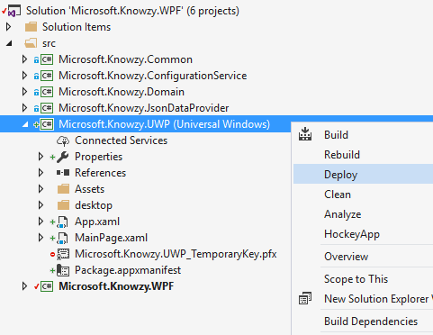

Note: If your Solution configuration is **Debug | Any CPU** you will need to enable both the Build and Deploy of the Microsoft.Knowzy.UWP app using the Configuration Manager.

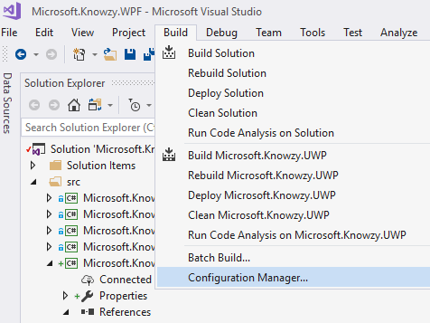

Make sure that both **Build** and **Deploy** are selected for the  Microsoft.Knowzy.UWP project.


* Right-click on the Microsoft.Knowzy.UWP project and select **Deploy** from the menu.

```console
1>------ Build started: Project: Microsoft.Knowzy.UWP, Configuration: Debug x86 ------
1>  Microsoft.Knowzy.UWP -> C:\Users\stammen\github\BuildTourHack\src\Microsoft.Knowzy.UWP\bin\x86\Debug\Microsoft.Knowzy.UWP.exe
1>C:\Program Files (x86)\MSBuild\15.0\.Net\CoreRuntime\Microsoft.Net.CoreRuntime.targets(236,5): error : Applications with custom entry point executables are not supported. Check Executable attribute of the Application element in the package manifest
========== Build: 0 succeeded, 1 failed, 0 up-to-date, 0 skipped ==========
========== Deploy: 0 succeeded, 0 failed, 0 skipped ==========
```

Unfortuately there is a bug in the current version of Visual Studio 2017 that prevents **Debug** builds of C# Desktop Bridge apps from being deployed. This bug will be fixed in a future update to Visual Studio 2017.
Until the bug is fixed, we will need to use the **Release** configuration for our C# Desktop Bridge app. We will use the ***Build | Configuration Manager** to set this up.

* Select **Configuration Manager** from the **Build** menu.
* For the Microsoft.Knowzy.UWP project, set the Configuration to **Release**. **You should also do this for the x86 and x64 Platform builds**.

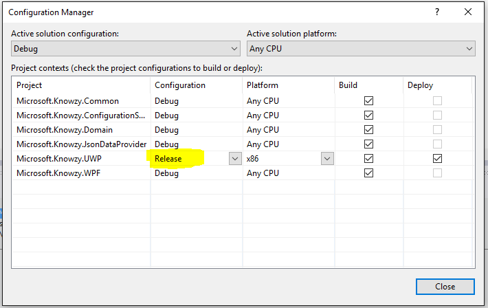

* Right-click on the Microsoft.Knowzy.UWP project and select **Deploy** from the menu.

```console
2>------ Deploy started: Project: Microsoft.Knowzy.UWP, Configuration: Release x86 ------
2>Creating a new clean layout...
2>Copying files: Total 11 mb to layout...
2>Checking whether required frameworks are installed...
2>Registering the application to run from layout...
2>Deployment complete (0:00:01.818). Full package name: "9aed127a-4cd4-4b87-a6a6-4b63499a73cb_1.0.0.0_x86__71pt5m19pd38p"
========== Build: 1 succeeded, 0 failed, 0 up-to-date, 0 skipped ==========
========== Deploy: 1 succeeded, 0 failed, 0 skipped ==========
```

Your Win32 WPF app has now been packaged as a UWP App using Visual Studio.


Search for your Microsoft.Knowzy.UWP in the Windows Start menu. Click on Microsoft.Knowzy.UWP to launch your app. 

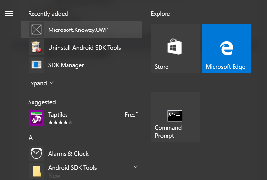

Unfortunately the Microsoft.Knowzy.UWP app did not run. Actually it did run but exited immediately due to an error.
The actual error is the app cannot load the project.json file it needs to generate the Products list. The app then 
throws an exception and exits.

Just so you aren't disappointed in not seeing the new UWP app run after completing all of these steps, let's quickly fix the issue with a hack.

* Open the file MainViewModel.cs in the ViewModels folder of the Microsoft.Knowzy.WPF project

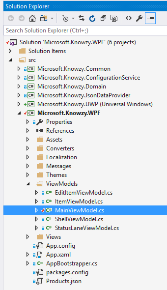

* Go to the OnViewAttached() method at line 70 and comment out lines 72-75 statement after base.OnActivate();

```c#
protected override void OnViewAttached(object view, object context)
{
    /*
    foreach (var item in _dataProvider.GetData())
    {
	DevelopmentItems.Add(new ItemViewModel(item, _eventAggregator));
    }
    */

    base.OnViewAttached(view, context);
}
```

* Select **Rebuild Solution** from the **Build** menu.

* Right-click on the Microsoft.Knowzy.UWP project and select **Deploy** from the menu.

* Search for your Microsoft.Knowzy.UWP in the Windows Start menu. Click on Microsoft.Knowzy.UWP to launch your app. 

The Microsoft.Knowzy.UWP app should now run with the hacked code.

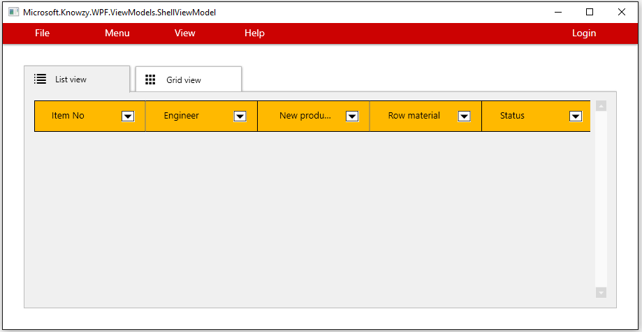


#### Step 6: Debugging your Desktop Bridge app

In order to fix the crashing bug in the UWP app, you need to be able to debug the various Knowzy projects. Let's try to debug the Microsoft.Knowzy.UWP project. 

* Right-click on the Microsoft.Knowzy.UWP project and select **Set as StartUp Project**

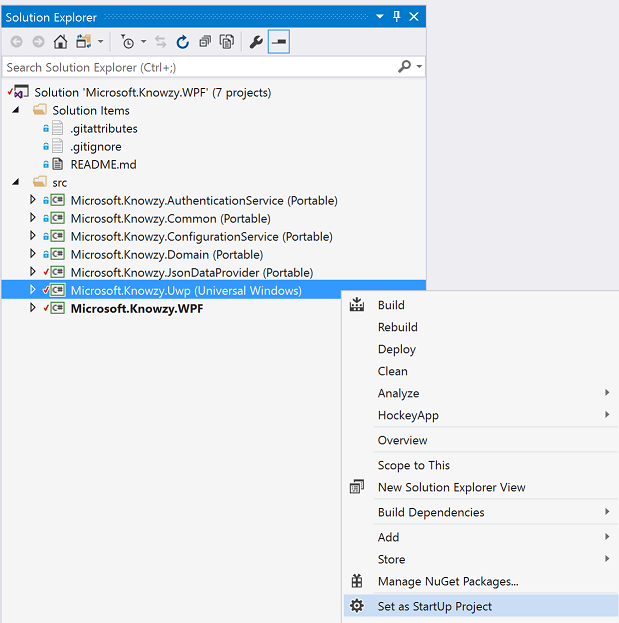

* Press F5 to start a debugging session for your UWP app. You will probably encounter the following error:

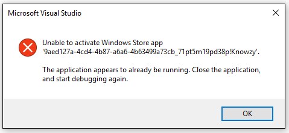

We will fix this error and enable the debugging of our app in the [next task](212_Debugging.md).

## References

* https://docs.microsoft.com/en-us/windows/uwp/porting/desktop-to-uwp-packaging-dot-net 
* https://github.com/qmatteoq/BridgeTour-Workshop
* https://mva.microsoft.com/en-us/training-courses/developers-guide-to-the-desktop-bridge-17373
