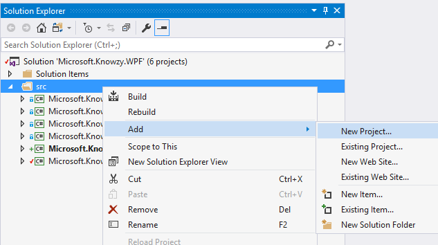
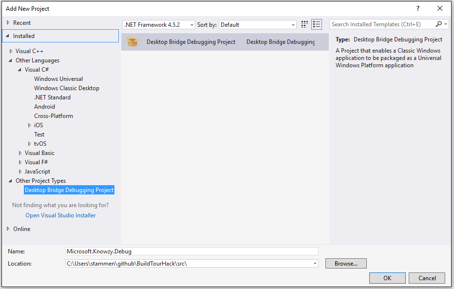
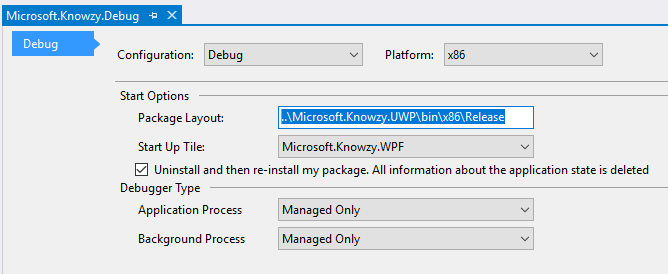
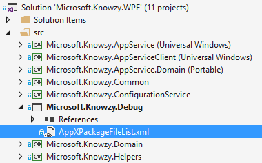
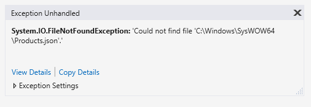
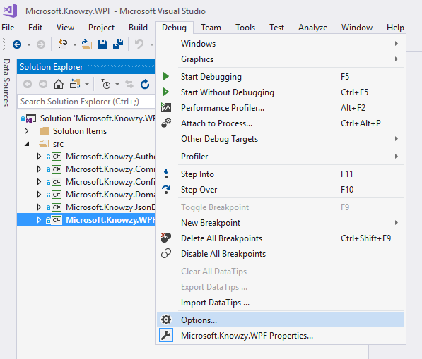
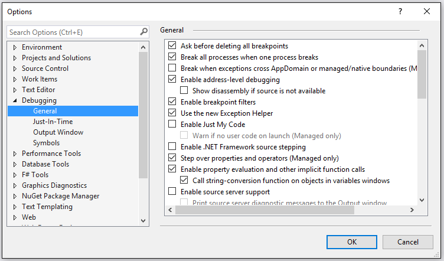
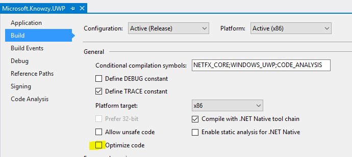

# Task 2.1.2 - Debugging a Windows Desktop Bridge App

This task will guide you through the process of debugging a Windows Desktop Bridge App using Visual Studio 2017. 

## Prerequisites 

* Basic knowledge of C# development

* Basic knowledge of client development with the .NET framework

* Basic knowledge of Windows 10 and the Universal Windows Platform

* A computer with Windows 10 Anniversary Update or Windows 10 Creators Update. If you want to use the Desktop App Converter with an installer, you will need at least a Pro or Enterprise version, since it leverages a feature called Containers which is not available in the Home version.

* Visual Studio 2017 with the tools to develop applications for the Universal Windows Platform. Any edition is supported, including the free [Visual Studio 2017 Community](https://www.visualstudio.com/vs/community/)

* The [Desktop Bridge Debugging Project template](https://marketplace.visualstudio.com/items?itemName=VisualStudioProductTeam.DesktoptoUWPPackagingProject) installed into Visual Studio 2017

* Complete the section on [Add Desktop Bridge Support using Visual Studio 2017](211_Centennial.md)

To get started, please open the **Microsoft.Knowzy.WPF.sln** in the **src\Knowzy_Engineering_Win32App** folder with Visual Studio 2017.

## Step 1: Install the Desktop Bridge Debugging Project Extension

If you do not have the Desktop Bridge Debugging Project extension installed into Visual Studio 2017, please complete the following steps:

1. Click on the **Tools** menu and select **Extensions and Updates...**

2. Select **Online** and enter **Desktop Bridge Debugging Project** in the search field. Click **Download**.

3. Close Visual Studio 2017 and the Desktop Bridge Debugging Project Extension will be installed.

4. Reopen your Desktop Bridge solution from the [Add Centennial Support using Visual Studio 2017](211_Centennial.md) task.

## Step 2: Add the Desktop Bridge Debugging Project to the Solution

* Right-click on the src folder in the Solution and select **Add | New Project...**

* Select the **Other Project Types | Desktop Bridge Debugging Project** project template. 

* Name the project Microsoft.Knowzy.Debug.

* Make sure you save the project to the **Knowzy_Engineering_Win32App\src** folder.

You solution should now contain the following projects.

* Right-click on the Microsoft.Knowzy.Debug project and select **Build Dependencies | Project Dependencies..."**

* Select the Microsoft.Knowzy.WPF and Microsoft.Knowzy.UWP projects and click **OK**.

## Step 3: Configure the Desktop Bridge Debugging Project

Since we will be working a lot with the Microsoft.Knowzy.UWP project, set the Build Configuration and Platform to **Debug | x86**

**Clean** the solution by selecting **Clean Solution** from the **Build** menu.

**Build** the x86 configuration of the solution. (Select **Build Solution** from the **Build** menu).

After the build completes, deploy the Microsoft.Knowzy.UWP project so its AppX folder is created. The next step needs the AppX folder.
(Select **Deploy Solution** from the **Build** menu).

Right-click on the Microsoft.Knowzy.Debug project and select **Set as Startup Project**. 

Right-click on the Microsoft.Knowzy.Debug project and select **Properties**. 

For Debug builds use the following settings:

* Package Layout: ..\Microsoft.Knowzy.UWP\bin\x86\Release

* Select Uninstall and then re-install my package.

* From the **Package Layout** field tab to the **Start Up Tile** field and select Microsoft.Knowzy.WPF.

Notice that we are specifying the path to the **Release** build of the Microsoft.Knowzy.UWP project. This is a fix for the
Visual 2017 C# UWP Desktop Bridge deployment bug we experienced in the previous task.

* Save and Close the Properties windows. 

	* **Note:** The Properties window can be a little buggy in saving your settings so make sure they were saved. Most issues with debugging are caused by
incorrect Debugging Project settings.

	* **Note:** You will need to add the correct Debugging Project Properties for x86 Release and x64 Debug and Release configurations if you want to build them.

* Open the AppXPackageFileList.xml file in the Microsoft.Knowzy.Debug project

* Modify the xml to the following:

        <?xml version="1.0" encoding="utf-8"?>
        <Project ToolsVersion="14.0"
                xmlns="http://schemas.microsoft.com/developer/msbuild/2003">
          <PropertyGroup>
            <MyProjectOutputPath>..\..\bin\Debug</MyProjectOutputPath>
          </PropertyGroup>
          <ItemGroup>
            <LayoutFile Include="$(MyProjectOutputPath)\Microsoft.Knowzy.WPF.exe">
              <PackagePath>$(PackageLayout)\desktop\Microsoft.Knowzy.WPF.exe</PackagePath>
            </LayoutFile>
          </ItemGroup>
        </Project>

This XML describes to the DesktopBridge Debugging project the location of the Microsoft.Knowzy.WPF.exe after it is built. It will use it when the project is launched and copy it to the correct location in the AppX package.
This will allow for any changes to the Microsoft.Knowzy.WPF project code to be included in the debugging session. The need for the Desktop Bridge Debugging project will most likely change in future updates to Visual Studio 2017.

* Save your changes. 

* Now it is time to **Clean** the solution and then **Build** the Solution.

* If you get a Build error stating the layout file could not be found you may need to manually deploy the Microsoft.Knowzy.UWP project by right-clicking on the Microsoft.Knowzy.UWP project and selecting **Deploy**. 
Then build the solution again.

* Press F5 and your UWP app will now be deployed and launch successfully. You should now be able to set breakpoints in the Microsoft.Knowzy.WPF source code.

**Note:** There is a intermitent bug in the Desktop Bridge Debugging Project ** where it may hang when deploying a build. If this happens, use the Task Manager to kill Visual Studio and then reopen then solution. 
You should then be able to build and run the app.

* Set a breakpoint at line 79 in the file ViewModels\MainViewModel.cs in the Microsoft.Knowzy.WPF project. Restart the debugging session and it should break into the debugger at line 79. If you do not hit the breakpoint, 
**Clean** and **Build** your solution again.

* Stop debugging and remove the comments we added in the previous task. Press F5 to start the app. You should get the following exception:

For some reason, our UWP app is unable to load the Project.json file and it appears that our app is looking for the file in the wrong directory. This is a common problem with newly converted Desktop Bridge apps.
Depending on how the code is written, the app may be trying to load files from the wrong location. We will fix this in the next task.

Step 4: Additional Debugging Settings

In order to be able to easily debug both both the WPF and UWP portions of our app, we need to specify a few more debugging settings.

* Select **Options...** from the **Debug** menu.

* Click on **Debugging | General** and turn off the **Enable Just My Code** options

* Right-click on the Microsoft.Knowzy.UWP project and select **Properties**.

* Select the **Build** tab and turn off **Optimize Code**

* Select the **Debug** tab and turn on **Do not launch, but debug my code when it starts**

We will now fix the products.json issue in the [next task](213_AddUwp.md).

## References
* [Run, debug, and test a packaged desktop app (Desktop Bridge)](https://docs.microsoft.com/en-us/windows/uwp/porting/desktop-to-uwp-debug)

* [DesktopBridge To UWP Samples](https://github.com/Microsoft/DesktopBridgeToUWP-Samples)

* [Package a .NET app using Visual Studio ](https://docs.microsoft.com/en-us/windows/uwp/porting/desktop-to-uwp-packaging-dot-net)

* [BridgeTour Workshop](https://github.com/qmatteoq/BridgeTour-Workshop)

* [Developers Guide to the Desktop Bridge](https://mva.microsoft.com/en-us/training-courses/developers-guide-to-the-desktop-bridge-17373)

## continue to [next task >> ](213_AddUwp.md)