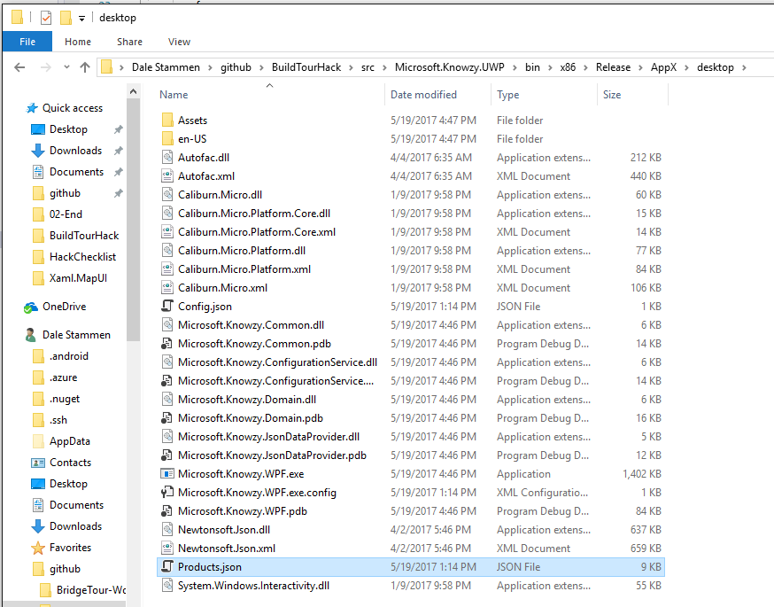
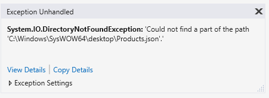
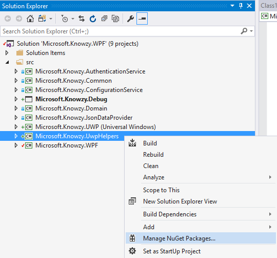
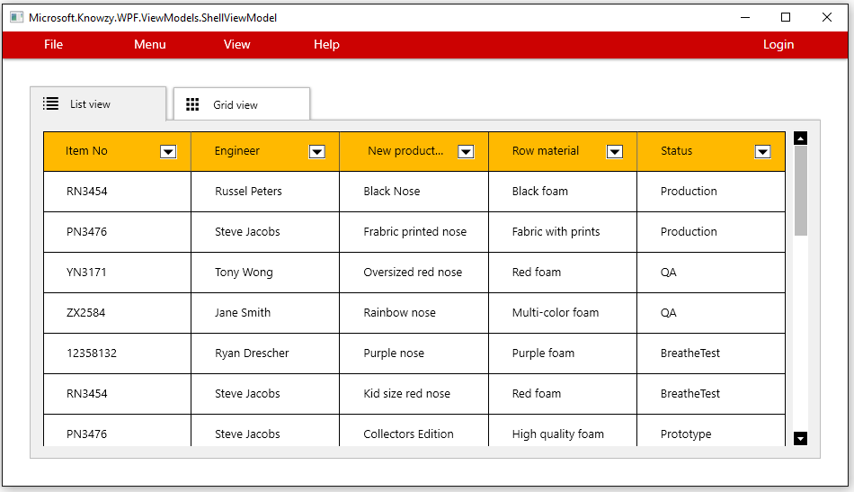
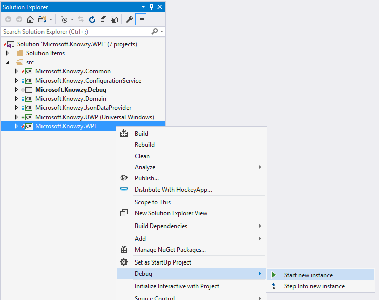
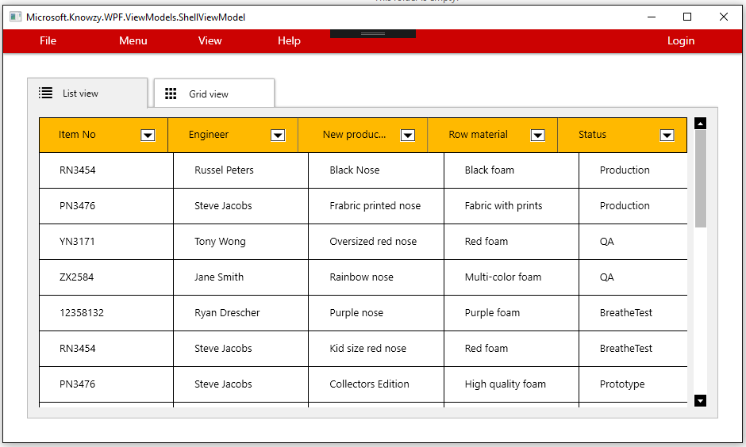

# Task 2.1.3 - Adding Windows 10 UWP APIs to your Desktop Bridge App

This task will guide you through the process of adding Windows 10 UWP APIs to your Desktop Bridge app. 

## Prerequisites 

* Basic knowledge of C# development
* Basic knowledge of client development with the .NET framework
* Basic knowledge of Windows 10 and the Universal Windows Platform
* A computer with Windows 10 Anniversary Update or Windows 10 Creators Update. If you want to use the Desktop App Converter with an installer, you will need at least a Pro or Enterprise version, since it leverages a feature called Containers which isn’t available in the Home version.
* Visual Studio 2017 with the tools to develop applications for the Universal Windows Platform. Any edition is supported, including the free [Visual Studio 2017 Community](https://www.visualstudio.com/vs/community/)
* Complete the section on [Debugging a Windows Desktop Bridge App](212_Debugging.md)

To get started, please open the **Microsoft.Knowzy.WPF.sln** in the **BuildTourHack\src\Knowzy_Engineering_Win32App** folder with Visual Studio 2017.

## Task

In this task we will do the following:

* Configure our Desktop Bridge projects to be able to use Windows 10 UWP APIs.
* Add NuGet packages to our project that will make it easier to use the Windows 10 UWP APIs
* Fix the issue from the previous tasks where the Desktop Bridge app was not able to load the Product.json file when running as a UWP app.

In the previous tasks we discovered that our Desktop Bridge version of the Knowzy app cannot find the required file Products.json. The UWP version is looking for Products.json in the location expected by the 
WPF version. We need to correct this code so that when the UWP version of Knowzy is running it will look for the file in the correct location.

* Searching the code for Products.json we find it in a file called Config.json. 

```json
{
  "JsonFilePath": "Products.json",
  "DataSourceUrl": "http://"
}
```

* Searching for JsonFilePath, we find it in src\Microsoft.KnowzyJsonDataProvider\JsonDataProvider.cs

```c#
public Product[] GetData()
{
    var jsonFilePath = _configuration.Configuration.JsonFilePath;
    return _jsonHelper.Deserialize<Product[]>(_fileHelper.ReadTextFile(jsonFilePath));
}
```

* Setting a breakpoint at line 31 of JsonDataProvider.cs and stepping through the code we eventually find that ReadTextFile is looking for the Products.json file in the installed directory of the app.

When we created the Desktop Bridge version of Knowzy we copied all of the WPF Knowzy binaries to the desktop folder of the Desktop Bridge app. 
After a build and deployment of the Knowzy app, we will find the Products.json file in the directory

src\Microsoft.Knowzy.UWP\bin\x86\Release\AppX\desktop



So an easy fix would be to try something like:

```c#        
public Product[] GetData()
{
    String jsonFilePath;
    
    if(IsRunningAsUwp())
    {
        jsonFilePath = "desktop\\" + _configuration.Configuration.JsonFilePath;
    }
    else
    {
        jsonFilePath = _configuration.Configuration.JsonFilePath;
    }

    return _jsonHelper.Deserialize<Product[]>(_fileHelper.ReadTextFile(jsonFilePath));
}
```

I'll save you some time and tell you that this won't work either. 



We actually need to do something like this:

```c#        
public Product[] GetData()
{
    String jsonFilePath;
    
    if(IsRunningAsUwp())
    {
        jsonFilePath = Path.Combine(GetUWPAppDir(),"desktop", _configuration.Configuration.JsonFilePath);
    }
    else
    {
        jsonFilePath = _configuration.Configuration.JsonFilePath;
    }

    return _jsonHelper.Deserialize<Product[]>(_fileHelper.ReadTextFile(jsonFilePath));
}
```

We are going to need to add at least 2 UWP methods to our DeskTop Bridge version of Knowzy in order to be able to load the Products.json file.
1. A method to detect if we are running the UWP version
1. A method that returns the directory of the UWP application

#### Step 1: Adding UWP support to the Knowzy App

We can add UWP APIs to our Knowzy app at any location we need the UWP code. However, it will be easier if we create a set of UWP helper classes and place then all in a single C# library. 

Since all of the other dependencies in the Knowzy WPF solution are Portable Class Libraries, we will add a new Portable Class Library called Microsoft.Knowzy.UwpHelpers.

* Right-click on the src folder in the solution

* Select the **Visual C# | Class Library (Portable)** project template.

* Name the library Microsoft.Knowzy.UwpHelpers. Make sure you are saving the project to the **src** directory.


* Select the following Targets and click **OK**:


There exists a convenient NuGet package called [UwpDesktop(https://www.nuget.org/packages/UwpDesktop)that makes it easy for you call into UWP APIs 
from Desktop and Centennial apps (WPF, WinForms, etc.) Let's add this NuGet package to our Microsoft.Knowzy.UwpHelpers project.

* Right-click on the Microsoft.Knowzy.UwpHelpers project and select **Manage NuGet Packages...**



* Click on **Browse**, enter DesktopBridge.Helpers in the search field and then click on  **Install**


* **Note:** Every time you add a NuGet package to a Desktop Bridge project you should probably rebuild the solution so the newly added NuGet package DLLs are correctly added to the UWP project.
If you get a DLL not found exception when running your app, it may be because the AppX is missing the newly added DLL.


* Add a new C# class to the Microsoft.Knowzy.UwpHelpers . Name the file ExecutionMode.cs.

* Add the following code to ExecutionMode.cs. This code detects if the app is running as a UWP app.

```c#
using System;
using System.Runtime.InteropServices;
using System.Text;
using Windows.System.Profile;

namespace Microsoft.Knowzy.UwpHelpers
{
    public class ExecutionMode
    {
        [DllImport("kernel32.dll", CharSet = CharSet.Unicode, SetLastError = true)]
        static extern int GetCurrentPackageFullName(ref int packageFullNameLength, ref StringBuilder packageFullName);

         public static bool IsRunningAsUwp()
         {
            if (isWindows7OrLower())
            {
                return false;
            }
            else
            {
                StringBuilder sb = new StringBuilder(1024);
                int length = 0;
                int result = GetCurrentPackageFullName(ref length, ref sb);

                return result != 15700;
            }
        }

        internal static bool isWindows7OrLower()
        {
            try
            {
                string deviceFamilyVersion = AnalyticsInfo.VersionInfo.DeviceFamilyVersion;
                ulong version = ulong.Parse(deviceFamilyVersion);
                ulong major = (version & 0xFFFF000000000000L) >> 48;
                ulong minor = (version & 0x0000FFFF00000000L) >> 32;
                double osVersion = (double)major + ((double)minor / 10.0);
                return osVersion <= 6.1;
            }
            catch
            {
                return false;
            }
        }
    }
}
```

* Right-click on the Microsoft.Knowzy.JsonDataProvider project, select **Add | Reference...** and a reference to the Microsoft.Knowzy.UwpHelpers project.

* We can now modify src\Microsoft.KnowzyJsonDataProvider\JsonDataProvider.cs as follows:


```c#
using Microsoft.Knowzy.UwpHelpers;
using System;

public Product[] GetData()
{
    String jsonFilePath;

    if (ExecutionMode.IsRunningAsUwp())
    {
        jsonFilePath = "desktop\\" + _configuration.Configuration.JsonFilePath;
    }
    else
    {
        jsonFilePath = _configuration.Configuration.JsonFilePath;
    }

    return _jsonHelper.Deserialize<Product[]>(FileHelper.ReadTextFile(jsonFilePath));
}
```

* Build your solution and then set a break point at the following line of JsonDataProvider.cs (around line 40). 

```c#
     if (ExecutionMode.IsRunningAsUwp())
```
   
* Press F5 to launch your app and...

    **execution does not stop at the breakpoint!**
    
The build did not pick up our changes to Microsoft.Knowzy.JsonDataProvider. (Or if you rebuilt the entire solution, the changes did make it into the build).
In order to prevent having to do complete rebuilts of our solution every time we change some code, we need to tell the DesktopBridge Debugging Project (Microsoft.Knowzy.Debug) which DLL's to copy to the AppX.
Unfortunately, the current version of Visual Studio 2017 is not able to correcty handle code changes Desktop Bridge dependencies.

Since we will be modifying the Microsoft.Knowzy.JsonDataProvider and Microsoft.Knowzy.Common projects, let's add them to AppXPackageFileList.xml in the Microsoft.Knowzy.Debug project.

```xml
<?xml version="1.0" encoding="utf-8"?>
<Project ToolsVersion="14.0"
         xmlns="http://schemas.microsoft.com/developer/msbuild/2003">
  <PropertyGroup>
    <MyProjectOutputPath>..\..\bin\Debug</MyProjectOutputPath>
  </PropertyGroup>
  <ItemGroup>
    <LayoutFile Include="$(MyProjectOutputPath)\Microsoft.Knowzy.WPF.exe">
      <PackagePath>$(PackageLayout)\desktop\Microsoft.Knowzy.WPF.exe</PackagePath>
    </LayoutFile>
    <LayoutFile Include="$(MyProjectOutputPath)\Microsoft.Knowzy.JsonDataProvider.dll">
      <PackagePath>$(PackageLayout)\desktop\Microsoft.Knowzy.JsonDataProvider.dll</PackagePath>
    </LayoutFile>
    <LayoutFile Include="$(MyProjectOutputPath)\Microsoft.Knowzy.UwpHelpers.dll">
      <PackagePath>$(PackageLayout)\desktop\Microsoft.Knowzy.UwpHelpers.dll</PackagePath>
    </LayoutFile>
  </ItemGroup>
</Project>
```
    
Now every time you make a code change to Microsoft.Knowzy.JsonDataProvider or Microsoft.Knowzy.UwpHelpers, the changes will be part of the build.

Press F5 again and now you should be able to hit the breakpoint in JsonDataProvider.cs.

#### Step 2: Adding UWP support to detect the AppX Installation Folder

We are now going to start adding Windows 10 UWP APIs to our app in order to find the AppX folder's install location and in later tasks to add new Windows 10 features to our app. 

* Add a new C# class to theMicrosoft.Knowzy.Common UwpHelpers project. Name the file AppFolders.cs.

* Add the following code to AppFolders.cs. This code uses methods from the Windows 10 UWP API

```c#
namespace Microsoft.Knowzy.UwpHelpers
{
    public class AppFolders
    {
        public static string Current
        {
            get
            {
                string path = null;
                if (ExecutionMode.IsRunningAsUwp())
                {
                    path = GetSafeAppxFolder();
                }
                return path;
            }
        }

        internal static string GetSafeAppxFolder()
        {
            try
            {
                return Windows.ApplicationModel.Package.Current.InstalledLocation.Path;
            }
            catch (Exception ex)
            {

                System.Diagnostics.Debug.WriteLine(ex.Message);
            }
            return null;
        }
    }
}
```

This code uses the Package class in Windows.ApplicationModel.Package to determine the installed location of the UWP AppX folder.

* We can now modify JsonDataProvider.cs as follows:

```c#

using System.IO;

public Product[] GetData()
{
    public Product[] GetData()
    {
        String jsonFilePath;

        if (ExecutionMode.IsRunningAsUwp())
        {
            jsonFilePath = Path.Combine(AppFolders.Current, "desktop", _configuration.Configuration.JsonFilePath);
        }
        else
        {
            jsonFilePath = _configuration.Configuration.JsonFilePath;
        }

        return _jsonHelper.Deserialize<Product[]>(_fileHelper.ReadTextFile(jsonFilePath));
    }
}
```

Press F5 to run the Microsoft.Knowzy.Debug project. Finally our Knowzy UWP app can load the Products.json file from the correct location and display the information correctly.



We can also still run our original WPF version. The UWP additions are ignored by the WPF version. To try this out right-click on the Microsoft.Knowzy.WPF project and select **Debug | Start new instance**



The WPF app still continues to work as it was originally coded.



We will continue to add more Windows 10 UWP features to our app in the [next task](214_WindowsHello.md).


## References
* https://docs.microsoft.com/en-us/uwp/api/windows.applicationmodel.package
* https://blogs.msdn.microsoft.com/appconsult/2016/11/03/desktop-bridge-identify-the-applications-context/
* https://github.com/qmatteoq/DesktopBridgeHelpers
* https://www.nuget.org/packages/DesktopBridge.Helpers/
* https://blogs.windows.com/buildingapps/2017/01/17/announcing-uwpdesktop-nuget-package-version-14393/#SfO8ORg9vZY6h9dj.97
* https://www.nuget.org/packages/UwpDesktop
* https://github.com/ljw1004/uwp-desktop
* https://docs.microsoft.com/en-us/windows/uwp/porting/desktop-to-uwp-debug
* https://github.com/Microsoft/DesktopBridgeToUWP-Samples 
* https://docs.microsoft.com/en-us/windows/uwp/porting/desktop-to-uwp-packaging-dot-net 
* https://github.com/qmatteoq/BridgeTour-Workshop
* https://mva.microsoft.com/en-us/training-courses/developers-guide-to-the-desktop-bridge-17373
