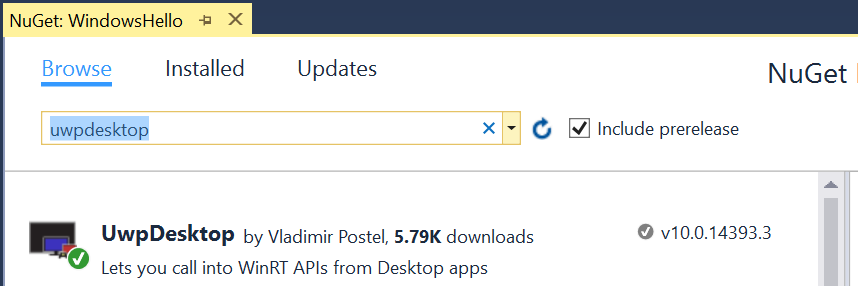

# Task 2.1.3 - Integrate Windows Hello authentication

This task will guide you through the process of adding the Windows Hello UWP API to your Win32 Desktop app using Visual Studio 2017. 

## Prerequisites 

* Basic knowledge of C# development
* Basic knowledge of client development with the .NET framework
* Basic knowledge of Windows 10 and the Universal Windows Platform
* A computer with Windows 10 Anniversary Update or Windows 10 Creators Update. If you want to use the Desktop App Converter with an installer, you will need at least a Pro or Enterprise version, since it leverages a feature called Containers which isn’t available in the Home version.
* Visual Studio 2017 with the tools to develop applications for the Universal Windows Platform. Any edition is supported, including the free [Visual Studio 2017 Community](https://www.visualstudio.com/vs/community/)
* Complete the section on [Add Centennial Support using Visual Studio 2017](211_Centennial.md)

## Task

We will use the Centennail based application which was created in [Add Centennial Support using Visual Studio 2017](211_Centennial.md) as a starting point.

#### Step 1: Add the UwpDesktop nuget package 


#### Step 2: Add the Windows Hello API to your WPF
Using the KeyCredentialManager UWP API we can use Windows Hello.

Double click your MainPage.xaml.cs

Add the following code:
```csharp
        public MainWindow()
        {
            InitializeComponent();
            this.Loaded += MainWindow_Loaded;
        }

        private async void MainWindow_Loaded(object sender, RoutedEventArgs e)
        {
            var result = await KeyCredentialManager.IsSupportedAsync();

            if (result)
            {
                var authenticationResult = await KeyCredentialManager.RequestCreateAsync("login", KeyCredentialCreationOption.ReplaceExisting);
                if (authenticationResult.Status == KeyCredentialStatus.Success)
                {
                    // Do Something 
                }
                else
                {
                    // Show failure message
                }
            }
        }
```
 
## References
