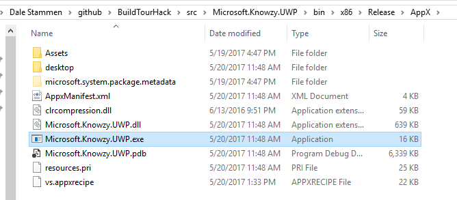
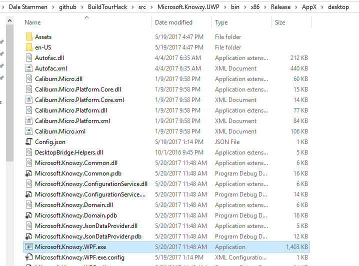
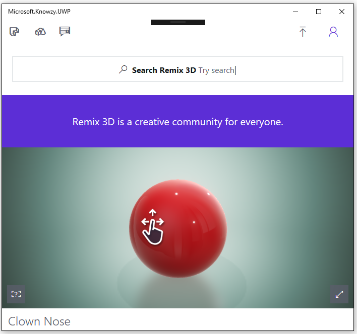

# Task 2.2.1 -  Create a new XAML view as part of app package

This task will guide you through the process of adding a Windows 10 UWP XAML UI to your Win32 Desktop Bridge app using Visual Studio 2017. 
We will also add support for using Windows 10 UWP Protocols to communicate between the WPF exe and and UWP exe. 

## Prerequisites 

* Basic knowledge of C# development
* Basic knowledge of client development with the .NET framework
* Basic knowledge of Windows 10 and the Universal Windows Platform
* A computer with Windows 10 Anniversary Update or Windows 10 Creators Update. If you want to use the Desktop App Converter with an installer, you will need at least a Pro or Enterprise version, since it leverages a feature called Containers which isn’t available in the Home version.
* Visual Studio 2017 with the tools to develop applications for the Universal Windows Platform. Any edition is supported, including the free [Visual Studio 2017 Community](https://www.visualstudio.com/vs/community/)
* Completed the section on [Integrate Windows Hello Authentication](214_WindowsHello.md)

## Task 

Our Desktop Bridge version of the Knowzy app actually consists of two different executables. The original WPF version (Microsoft.Knowzy.WPF.exe) and the UWP version (Microsoft.Knowzy.UWP.exe). 
Microsoft.Knowzy.UWP.exe is located in src\Microsoft.Knowzy.UWP\bin\x86\Release\AppX.


 
Microsoft.Knowzy.WPF.exe is located in src\Microsoft.Knowzy.UWP\bin\x86\Release\AppX\desktop



The Application element in the Package.appxmanifest in the Microsoft.Knowzy.UWP project specifies that Microsoft.Knowzy.WPF.exe is the app to be launched when the user starts the Desktop Bridge UWP version of Knowzy. 
There is actually no mention of Microsoft.Knowzy.UWP.exe in the Package.appxmanifest and it currently will not run.
 
```xml
  <Applications>
    <Application Id="Knowzy" Executable="desktop\Microsoft.Knowzy.WPF.exe" EntryPoint="Windows.FullTrustApplication">
    </Application>
  </Applications>
```

We are now going to use the Microsoft.Knowzy.UWP.exe to display a UWP XAML UI page. We will launch Microsoft.Knowzy.UWP.exe by using [URI activation](https://docs.microsoft.com/en-us/windows/uwp/launch-resume/handle-uri-activation).

#### Step 1: Specify an Application Extension in the package manifest

As mentioned above, the Package.appxmanifest currently does not know anything about Microsoft.Knowzy.UWP.exe. We are going to add an Extension to the Application tag of the Package.appxmanifest.

* Right-click on the Package.appxmanifest file in the Microsoft.Knowzy.UWP project and select **View Code***

* Modify the Application section of the XML to add the following Extensions tag

```xml
    <Extensions>
      <uap:Extension Category="windows.protocol" Executable="Microsoft.Knowzy.UWP.exe" EntryPoint="Microsoft.Knowzy.UWP.App">
        <uap:Protocol Name="com.microsoft.knowzy.protocol.3d" />
      </uap:Extension>
    </Extensions>
```

* Your Application section should now look something like this:

```xml
    <Application Id="Knowzy" Executable="desktop\Microsoft.Knowzy.WPF.exe" EntryPoint="Windows.FullTrustApplication">
      <uap:VisualElements
        DisplayName="Microsoft.Knowzy.UWP"
        Square150x150Logo="Assets\Square150x150Logo.png"
        Square44x44Logo="Assets\Square44x44Logo.png"
        Description="Microsoft.Knowzy.UWP"
        BackgroundColor="transparent">
        <uap:DefaultTile Wide310x150Logo="Assets\Wide310x150Logo.png"/>
        <uap:SplashScreen Image="Assets\SplashScreen.png" />
      </uap:VisualElements>
      <Extensions>
        <uap:Extension Category="windows.protocol" Executable="Microsoft.Knowzy.UWP.exe" EntryPoint="Microsoft.Knowzy.UWP.App">
          <uap:Protocol Name="com.microsoft.knowzy.protocol.3d" />
        </uap:Extension>
      </Extensions>
    </Application>
```

The Microsoft.Knowzy.UWP app will now be registered as a handler for the com.microsoft.knowzy.protocol.3d Uniform Resource Identifier (URI) name.

* Build and Deploy the Microsoft.Knowzy.UWP project to make sure your Package.appxmanifest file is valid. 

#### Step 2: Handle the activated event in Microsoft.Knowzy.UWP

When another app sends the Knowzy app a protocol message using the com.microsoft.knowzy.protocol.3d URI, Microsoft.Knowzy.UWP.exe will be activated by the operationg system. 
We need to add some code to Microsoft.Knowzy.UWP to handle the URI activation.

* Open the file App.xaml.cs in the Microsoft.Knowzy.UWP project.

* Add the following activation code at the bottom of the App class:

```c#
protected override void OnActivated(IActivatedEventArgs args)
{
    if (args.Kind == ActivationKind.Protocol)
    {
        ProtocolActivatedEventArgs eventArgs = args as ProtocolActivatedEventArgs;
        // TODO: Handle URI activation
        // The received URI is eventArgs.Uri.AbsoluteUri

        Uri uri = eventArgs.Uri;
        if (uri.Scheme == "com.microsoft.knowzy.protocol.3d")
        {
            Frame rootFrame = new Frame();
            Window.Current.Content = rootFrame;
            rootFrame.Navigate(typeof(MainPage), uri.Query);
            Window.Current.Activate();
        }
    }
}
```

This code will present the MainPage of the app if it receives the URI com.microsoft.knowzy.protocol.3d.

* Open the file MainPage.xaml in the Microsoft.Knowzy.UWP project. Modify the XAML to add a WebView

```xml
    <Grid Background="{ThemeResource ApplicationPageBackgroundThemeBrush}">
        <WebView Name="webView" />
    </Grid>
```

* Open the file MainPage.xaml.cs in the Microsoft.Knowzy.UWP project. Add the following method to the MainPage class:

```xml
protected override void OnNavigatedTo(NavigationEventArgs args)
{
    if (args.Parameter != null)
    {
        WwwFormUrlDecoder decoder = new WwwFormUrlDecoder(args.Parameter.ToString());
        try
        {
            var message = decoder.GetFirstValueByName("nose");
            webView.Source = new Uri(message);
        }
        catch(Exception ex)
        {
            System.Diagnostics.Debug.WriteLine("MainPage OnNavigatedTo Error: "  + ex.Message);
        }
    }
}
```

#### Step 3: Add the Windows 10 UWP URI sending code to the WPF app

Now that the Microsoft.Knowzy.UWP app knows how to handle a URI request, we are going to add code to the Microsoft.Knowzy.WPF project to make the URI request.

* Add a new C# class to the Helpers folder of the Microsoft.Knowzy.UwpHelpers project. Name the file UriProtocol.cs.

* Add the following method to the UriProtocol class. Make sure the class is public,

 ```c#
public class UriProtocol
{
    public static async Task<bool> SendUri(Uri uri)
    {
        // Note: DesktopBridge.Helpers NuGet package incorrectly warns that LaunchUriAsync is not supported in a Centennial App
        bool result = await Windows.System.Launcher.LaunchUriAsync(uri);
        return result;
    }
}
``` 
    
Intellisense may complain that LaunchUriAsync is only available to UWP apps. You can ignore this warning.

#### Step 4: Add the URI Code to the WPF App

Our Knowzy app has an unused View menu item. We will use this to call the code to launch the UWP XAML UI using the Windows 10 UWP uri code we added to the Helpers.


* Modify the XAML Microsoft.Knowzy.WPF\Views\MainView.xaml to add a Click event to the View MenuItem (around line 34)

```xml
<MenuItem Header="{x:Static localization:Resources.View_Menu}" Template="{DynamicResource MenuItemControlTemplate}">
    <MenuItem Header="{x:Static localization:Resources.ListView_Tab}" Template="{StaticResource MenuItemBarControlTemplate}" 
              cal:Message.Attach="ShowListView()"/>
    <MenuItem Header="Grid view" Template="{StaticResource MenuItemBarControlTemplate}"
              cal:Message.Attach="ShowGridView()"/>
    <MenuItem Header="View 3D" Template="{StaticResource MenuItemBarControlTemplate}"
              cal:Message.Attach="Show3DView()"/>
</MenuItem>
```

* Add a Show3DView() method to Microsoft.Knowzy.WPF\Models\MainViewModel.cs

```c#
using Microsoft.Knowzy.UwpHelpers;
using System;

public async void Show3DView()
{
    if (ExecutionMode.IsRunningAsUwp())
    {
        Uri uri = new Uri("com.microsoft.knowzy.protocol.3d://" + "message?nose=" + "https://www.remix3d.com/details/G009SXPQ5S3P");
        await UriProtocol.SendUri(uri);
    }
    else
    {
        MessageBox.Show("3D View not implemented in WPF version", "Microsoft.Knowzy.WPF");
    };
}

```        

* Build and run the solution (with Windows.Knowzy.Debug as the startup application)

* Select **View 3D** from the **View** menu. The Xaml ui of the Microsoft.Knowzy.UWP app will appear and display the 3D clown nose specified by the Uri parameters.



* If you want to suggest to Windows 10 the size of the XAML UI Window, add the following code to the MainPage constructor:

```c#
using Windows.UI.ViewManagement;

public MainPage()
{
    this.InitializeComponent();
    ApplicationView.GetForCurrentView().TryResizeView(new Size(800, 800));
}
```
    
We will continue to add more Windows 10 UWP features to our app in the [next task](222_Share.md).

## References    

* https://docs.microsoft.com/en-us/windows/uwp/launch-resume/handle-uri-activation
* https://github.com/ljw1004/uwp-desktop
* https://docs.microsoft.com/en-us/windows/uwp/porting/desktop-to-uwp-debug
* https://github.com/Microsoft/DesktopBridgeToUWP-Samples 
* https://docs.microsoft.com/en-us/windows/uwp/porting/desktop-to-uwp-packaging-dot-net 
* https://github.com/qmatteoq/BridgeTour-Workshop
* https://mva.microsoft.com/en-us/training-courses/developers-guide-to-the-desktop-bridge-17373
