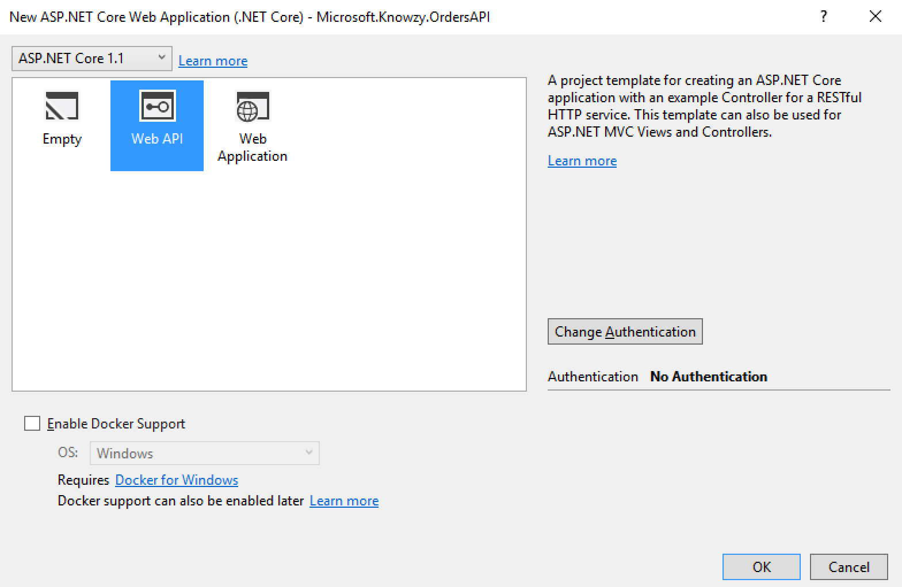
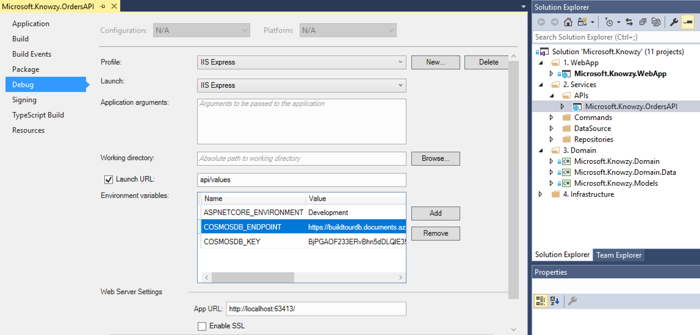

# Task 4.1.2 - Create API endpoint for shipping services

## Prerequisites 

* This task has a dependency on [Task 4.1.1][411] and all of its prerequisites.
* [.NET Core SDK 1.1](https://www.microsoft.com/net/download/core)


## Creating a .NET Core App

### 1. Create a New WebAPI Project

From the command line or Windows Explorer create a new folder called `APIs` to the `src\2. Services` folder of the solution.

Open the `Microsoft.Knowzy` solution in Visual Studio 2017. Add a new solution folder called `APIs` to the `2. Services` folder, and create a new `ASP.NET Core` project to it in that folder:


Choose Web API for the project type, and leave the other options as they are (we will add Docker support later):


Note: you can also use [the dotnet cli to create a new .NET Core WebAPI project as documented here](https://docs.microsoft.com/en-us/aspnet/core/tutorials/web-api-vsc).

Let's test it out to make sure everything is working properly. You can use both the command line/terminal from the folder of this new project (`src\2. Services\APIs\Microsoft.Knowzy.OrdersAPI`):

```bash
dotnet restore
dotnet run
```

Or in Visual Studio right click on the project and select `Debug -> Start New Instance`.
 

Navigate to [http://localhost:5000/api/values/5](http://localhost:5000/api/values/5) to see your app running, you should see the word `value` returned in the browser. Press `Ctrl+C` if you started in the console/terminal or click the Stop button in Visual Studio to stop the API.

### 2. Add functionality

Let's make a small change to the API so that it responds to our inputs. Modify the code in `ValuesController.cs` in the `Controllers` folder with the following changes:

```diff
// GET api/values/5
[HttpGet("{id"})]
public string Get(int id)
{
-  return "value";
+  return $"The value is {id}";
}
```

Using the terminal run the project to see our changes:

```bash
dotnet run
```
Or run the project from Visual Studio again.


This time, when you navigate to [http://localhost:5000/api/values/5](http://localhost:5000/api/values/5), you should see `The value is 5`

### 3. Using Environment Variables and Connecting to CosmosDB

In a real-world app, you won't check your secrets into source control, and you won't be writing local code that connects directly to your production data store. Depending on your environment, you might not even have access to production. To address these issues and see how they tie in with Docker, we're going to use the `COSMOSDB_ENDPOINT` and `COSMOSDB_KEY` environment variables.

The default Web API template already calls `.AddEnvironmentVariables()`, so we just need to set a variable, then access it in our code. 

If running from the command line, to set a variable run the following in a command prompt with the primary connection string for your account:

```
SET COSMOSDB_ENDPOINT=<your cosmosdb endpoint>
SET COSMOSDB_KEY=<your cosmosdb account key>
```

If running from Visual Studio 2017, add these values to the Environment Variables section of the `Microsoft.Knowzy.OrdersAPI` project properties:


To use these environment variables in our code, we'll just pass the entire configuration object down to a new data access class.

In `Startup.cs`, make the following changes:

```diff
public void ConfigureServices(IServiceConnection services)
{
  // Add framework services.
  services.AddMvc();
+ services.AddSingleton<IConfiguration>(Configuration);
}
```

Now let's connect our solution to CosmosDB. Add a Nuget package reference to the `Microsoft.Azure.DocumentDB.Core` version 1.3.0 to the `Microsoft.Knowzy.OrdersAPI` project.

Add a new folder called `Data` to the `Microsoft.Knowzy.OrdersAPI` project. This folder will have the classes that interact with your CosmosDB data store. 

Add a new interface called `IOrdersStore.cs` to the `Data` folder and populate it with:
```
using System;
using System.Threading.Tasks;

namespace Microsoft.Knowzy.OrdersAPI.Data
{
    public interface IOrdersStore : IDisposable
    {
        Task<bool> Connected();
    }
}
```

Add a new class called `OrdersStore.cs` to the `Data` folder and populate it with a method to check if it can connect to CosmosDB. Make sure to update the Document Collection database and name to match the yours:

```
using System;
using System.Threading.Tasks;
using Microsoft.Extensions.Configuration;
using Microsoft.Azure.Documents.Client;

namespace Microsoft.Knowzy.OrdersAPI.Data
{
    public class OrdersStore : IOrdersStore
    {
        private readonly DocumentClient _client;
	    private Uri _ordersLink;
        public OrdersStore(IConfiguration config)
        {
            var EndpointUri = config["COSMOSDB_ENDPOINT"];
            var PrimaryKey = config["COSMOSDB_KEY"];
            _client = new DocumentClient(new Uri(EndpointUri), PrimaryKey);
			 //Make sure the below values match your set up
			 _ordersLink = UriFactory.CreateDocumentCollectionUri("buildtourdb", "orders");
        }

        public async Task<bool> Connected()
        {
            try
            {
                var db = await _client.GetDatabaseAccountAsync();
                return true;
            }
            catch
            {
                return false;
            }
        }

        private bool disposedValue = false; // To detect redundant calls
        protected virtual void Dispose(bool disposing)
        {
            if (!disposedValue)
            {
                if (disposing)
                {
                    _client.Dispose();
                }
                disposedValue = true;
            }
        }
        
        void IDisposable.Dispose()
        {
            Dispose(true);
        }
    }
}
```

Modify `Startup.cs` and register our data access with the list of services:

```diff
public void ConfigureServices(IServiceConnection services)
{
  // Add framework services.
  services.AddMvc();
  services.AddSingleton<IConfiguration>(Configuration);
+ services.AddSingleton<Data.IOrdersStore, Data.OrdersStore>();
}
```

To test it out, on your `ValuesController.cs` file update it as follows:

```
public class ValuesController : Controller
{
+        private IOrdersStore _ordersStore;
+        public ValuesController(IOrdersStore ordersStore)
+        {
+            _ordersStore = ordersStore;
+        }


...
    // GET api/values/5
    [HttpGet("{id}")]
    public string Get(int id)
    {
-      return "value";
+      var status = await _ordersStore.Connected() ? "connected" : "not connected";
+      return $"We are {status} to CosmosDB! and your value is {id}";
    }
  }
```

If you now run and call /api/values/5 on your API you should see `We are connected to CosmosDB! and your value is 5` returned.

### 4. Implement the Orders API

Now it's time to implement the endpoints for the Orders API, running the API as needed to verify your app locally before moving on.

In the `Microsoft.Knowzy.OrdersAPI` add a project reference to the `Microsoft.Knowzy.Domain` project. This reference has the model classes we will use in the Orders API.

Edit the `IOrdersStore.cs` interface to add the GetAllOrders method:

```diff
    public interface IOrdersStore : IDisposable
    {
        Task<bool> Connected();

+        IEnumerable<Domain.Receiving> GetAllOrders();
    }
``` 
And edit the `OrdersStore.cs` class to implement that method to return all orders:

```diff
...
+ using System.Linq;
...
+        public IEnumerable<Domain.Receiving> GetAllOrders()
+        {
+            var orders = _client.CreateDocumentQuery<Domain.Receiving>(_ordersLink);
+            if (orders != null && orders.Count() > 0)
+                return orders;
+            else
+                return null;
+        }
```

Edit the `ValuesController.cs` class in the `Controllers` folder to return all orders in the Get method:

```diff
...
+ using Microsoft.Knowzy.OrdersAPI.Data;
...
    public class ValuesController : Controller
    {

        // GET api/values
        [HttpGet]
-		  public IEnumerable<string> Get()
+        public IEnumerable<Domain.Receiving> Get()
        {
-            return new string[] { "value1", "value2" };
+            return _ordersStore.GetAllOrders();
        }
```

Now, when you run and browse your API to /api/values you should get an array with all the orders in the CosmosDB `orders` collection.

Now use this same logic and implement the rest of the Orders API methods needed by the website:
- Get a specific order by order id
- Insert a new order

### 5. Package for release

Now that we've got a working API app, let's package up all of our required files into a single folder for easy distribution. This time, we'll specify the Release configuration. 

In a terminal, run:

```bash
dotnet publish -c Release
```

Or from Visual Studio, change the configuration to `Release`, right click on the API project, select `Publish`, and choose `Folder` as the destination.

By default, this places your app files in a folder named `/bin/Release/netcoreapp1.1/publish` or `bin/Release/PublishOutput`. We'll use this output path in [Step 4.1.4][414] when we build a Docker image for our app.

## 6. References

* [Troubleshooting guide](499_Troubleshooting.md)
* [.NET Core CLI reference](https://docs.microsoft.com/en-us/dotnet/articles/core/tools/)
* [Introduction to ASP.NET Core](https://docs.microsoft.com/en-us/aspnet/core/)
* [Configuration in .NET Core](https://docs.microsoft.com/en-us/aspnet/core/fundamentals/configuration)
* [Azure Cosmos DB: Getting started with the DocumentDB API and .NET Core](https://docs.microsoft.com/en-us/azure/documentdb/documentdb-dotnetcore-get-started)

[411]: /stories/4/411_DocumentDB.md
[414]: /stories/4/414_Docker.md