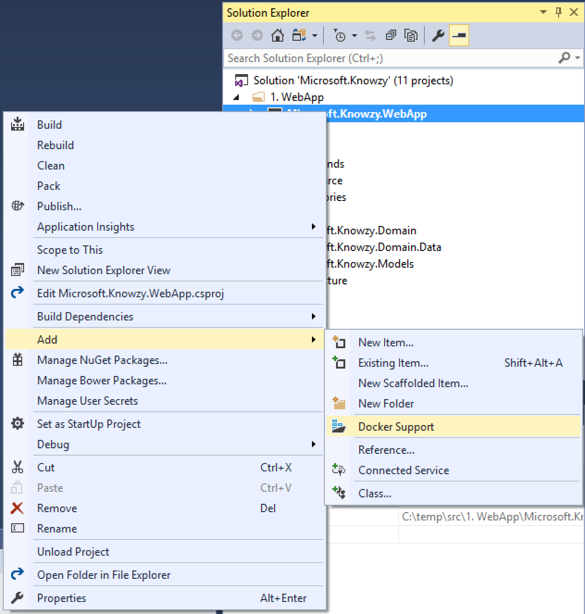

# Task 4.1.4 - Create Docker images

## 1. Prerequisites 

* [Docker for Windows](https://docs.docker.com/docker-for-windows/install/) (Stable channel)

### a. Configuring Docker for Windows

On Windows, you'll need to share your drive with Docker in order to build images.

i) Open up Docker settings by right-clicking the Docker icon in the taskbar, and choosing Settings

ii) Go to the `Shared Drives` tab and share the C drive 

## 2. Building Images


If you have Visual Studio 2017 you can have it create docker files for you by simply:
* Right click on the Microsoft.Knowzy.WebApp project, select `Add -> Docker Support`, then choose `Linux` and click OK.




This will create a Dockerfile file in your WebApp project, and add a new docker-compose project type to your solution.

* Use the same instructions and add Docker Support to the Microsoft.Knowzy.OrdersAPI project 
* Use the same instructions and add Docker Support to the Microsoft.Knowzy.ProductsAPI project

In the end you should have Dockerfile in each of those three projects, and all three referenced in your Docker compose project. 

Now under the `docker-compose.yml` file, find the `docker-compose.override.yml` file, and modify it with the following (changing the values of your CosmosDB endpoint and key):
```dockerfile
version: '3'

services:
  microsoft.knowzy.webapp:
    environment:
     - ASPNETCORE_ENVIRONMENT=Development
     - ASPNETCORE_URLS=http://0.0.0.0:5101
     - ORDERAPI_URL=http://microsoft.knowzy.ordersapi:5102
     - PRODUCTSAPI_URL=http://microsoft.knowzy.productsapi:5103
    ports:
      - "5101:5101"

  microsoft.knowzy.ordersapi:
    environment:
      - ASPNETCORE_ENVIRONMENT=Development
      - ASPNETCORE_URLS=http://0.0.0.0:5102
      - COSMOSDB_ENDPOINT=<**YOUR COSMOSDB ENDPOINT**>
      - COSMOSDB_KEY=<**YOUR KEY**>
    ports:
      - "5102:5102"

  microsoft.knowzy.productsapi:
    environment:
      - ASPNETCORE_ENVIRONMENT=Development
      - ASPNETCORE_URLS=http://0.0.0.0:5103
      - COSMOSDB_ENDPOINT=<**YOUR COSMOSDB ENDPOINT**>
      - COSMOSDB_KEY=<**YOUR KEY**>
    ports:
      - "5103:5103"
```

You can now start debugging the Docker Compose project; it will create all three docker images and run them on your local dev environment.

> NOTE: If not using Visual Studio you can still create the `Dockerfile` in the root of the web app and each of the APIs, the Docker Compose and Docker Compose override files using the reference below and above.


### Orders Api Dockerfile Reference
```Dockerfile
# Use the aspnetcore image as a base
FROM microsoft/aspnetcore:1.1

# Create a variable called source that has the path of the publish directory
ARG source

# Use /app inside the created container to hold our files
WORKDIR /app

# Expose port 80 from our created container. This gets overwritten by the docker compose override file
EXPOSE 80

# Copy our app into the current folder (/app). 
# Change path to ./bin/Release/netcoreapp1.1/publish if you used the command line to build the web and API apps
COPY ${source:-obj/Docker/publish} .

# The entrypoint for the container is the command: dotnet Microsoft.Knowzy.OrdersAPI.dll
ENTRYPOINT ["dotnet", "Microsoft.Knowzy.OrdersAPI.dll"]
```

### Products Api Dockerfile Reference
```Dockerfile
FROM microsoft/aspnetcore:1.1
ARG source
WORKDIR /app
EXPOSE 80
COPY ${source:-obj/Docker/publish} .
ENTRYPOINT ["dotnet", "Microsoft.Knowzy.ProductsAPI.dll"]
```

### Web App Dockerfile Reference
```Dockerfile
FROM microsoft/aspnetcore:1.1
ARG source
WORKDIR /app
EXPOSE 80
COPY ${source:-obj/Docker/publish} .
ENTRYPOINT ["dotnet", "Microsoft.Knowzy.WebApp.dll"]
```

> Note how we are using `dotnet` and the kestrel web server in the configuration to host the APIs and the Web App in their containers. For more information on hosting ASP.NET Core in production see this [article](https://docs.microsoft.com/en-us/aspnet/core/fundamentals/servers/).

### docker-compose.yml Reference
```Dockerfile
version: '3'

services:
  microsoft.knowzy.webapp:
    image: microsoft.knowzy.webapp
    build:
      context: ./src/1. WebApp/Microsoft.Knowzy.WebApp
      dockerfile: Dockerfile

  microsoft.knowzy.ordersapi:
    image: microsoft.knowzy.ordersapi
    build:
      context: ./src/2. Services/APIs/Microsoft.Knowzy.OrdersAPI
      dockerfile: Dockerfile

  microsoft.knowzy.productsapi:
    image: microsoft.knowzy.productsapi
    build:
      context: ./src/2. Services/APIs/Microsoft.Knowzy.ProductsAPI
      dockerfile: Dockerfile
```

And the `docker-compose.override.yml` file with the contents of the file explained earlier in this article.

An explanation of what's going on here:

|Argument|Description|
|---|---|
| `build` | Commands Docker to build a new image |
| `image` | The image name, for example `microsoft.knowzy.ordersapi`  <br/> Note: in Docker, tags are used as version numbers |
| `context` | Location of the Dockerfile |


## 3. Running locally on Docker

You're ready to run your apps on your local Docker host. In a terminal:

```bash
docker-compose -f "docker-compose.yml" -f "docker-compose.override.yml" kill
docker-compose -f "docker-compose.yml" -f "docker-compose.override.yml" down --rmi local --remove-orphans
docker-compose -f "docker-compose.yml" -f "docker-compose.override.yml" up -d --build
docker-compose -f "docker-compose.yml" -f "docker-compose.override.yml" start
```

This will kill and remove any previous versions of the containers, build and start them again.

Confirm that your images are part of docker:

```bash
docker image ls 
```

````
REPOSITORY                                                     TAG                 IMAGE ID            CREATED             SIZE
microsoft.knowzy.productsapi                                   latest              0cf302713f5a        12 minutes ago      325 MB
microsoft.knowzy.webapp                                        latest              a26d42ad4ecd        12 minutes ago      337 MB
microsoft.knowzy.ordersapi                                     latest              f48275db75b4        12 minutes ago      325 MB
````


Now that your app is running in a container on your local Docker host, you can see it by running the following in a terminal:

```bash
docker ps
```

The port mappings are defined in the docker compose override file. This is great! Without Docker, we'd only be able to launch one app at a time, or we'd have to figure out how to share port 80 across several apps, making them less independent. Since we've mapped host ports to containers, we're now able to interact with them by navigating to these urls:

* Orders API - [http://localhost:5102/api/values/5](http://localhost:5102/api/values/5)
* Products API - [http://localhost:5103/api/values/5](http://localhost:5103/api/values/5)
* Web App - [http://localhost:5101](http://localhost:5101)

Docker containers come and go frequently. We'll stop our currently running containers to free up some computing resources and ports on our host for future work.  In a terminal, run the following:

```bash
docker-compose -f "docker-compose.yml" -f "docker-compose.override.yml" kill
docker-compose -f "docker-compose.yml" -f "docker-compose.override.yml" down --rmi local --remove-orphans
```

Your containers are now stopped. To verify, run:

```bash
docker ps
```

Note that the containers still exist, they're just not currently running. You can see them by listing all containers by running:

```bash
docker ps -a
```

You don't have to use Docker Compose to run your containers and could do it all using just the `docker` command to create / start / remove the containers. 

## 4. Deploying to a Docker Registry

So far, we've developed a few applications, packaged them in Docker images, and have tested them in a production-like environment by running them inside a container on our local computer. To get our apps running in the cloud, our next step is to push our images to a Docker registry.

We're going to create a private registry to hold our images, using [Azure Container Registry](https://docs.microsoft.com/en-us/azure/container-registry/container-registry-intro). We'll do this for a few reasons. First, we want to make sure our images aren't available to just anyone on the Internet. We want to be able to control access to our images! We also want our images to be available in the same region as our compute resources for quick deployments.

### <a id="acr"></a> a. Create an Azure Container Registry

Using the Azure Cloud Shell, set up some variables for your registry. These will be specific to you:

```bash
RESOURCE_GROUP=myResourceGroup
ACR_NAME=buildtourregistry
```

Next, we'll fire off a command to create your container registry. 

Note the use of the `--admin-enabled` switch, which enables a simple username/password logon. In a production environment, you'll likely want to disable this option and create a Service Principal, but this will get us up and running for now.

```bash
az acr create --resource-group $RESOURCE_GROUP --name $ACR_NAME --sku Basic --admin-enabled
```

You're all set up with a registry, with the full name of `$ACR_NAME.azurecr.io`.

Execute the following command to get the admin password for your newly created registry:

```bash
az acr credential show -n $ACR_NAME -g $RESOURCE_GROUP
```

### b. Connect to Your Registry

Hop back over to a local terminal. Let's login to our registry so we can push some images. Run the following command, using either the `password` or `password2` result from the previous command as your password:

```bash
docker login -u $ACR_NAME -p <your password> $ACR_NAME.azurecr.io
```

### c. Push an Image

We've already got some tagged images, and now we need to tell Docker that they're associated with our newly created registry. We'll specify the `knowzy` namespace before we push them to keep these apps grouped together. This is as simple as adding another tag for our existing images, using the following commands.

```bash
docker tag microsoft.knowzy.orderssapi $ACR_NAME.azurecr.io/knowzy/ordersapi:1
docker tag microsoft.knowzy.productsapi $ACR_NAME.azurecr.io/knowzy/productsapi:1
docker tag microsoft.knowzy.webapp $ACR_NAME.azurecr.io/knowzy/webapp:1
```

To push images to your registry, use the following commands:

```bash
docker push $ACR_NAME.azurecr.io/knowzy/ordersapi:1
docker push $ACR_NAME.azurecr.io/knowzy/productsapi:1
docker push $ACR_NAME.azurecr.io/knowzy/webapp:1
```

When finished, you can verify that your repositories and tags have been created by using the following commands:

```bash
az acr repository list -n $ACR_NAME
az acr repository show-tags -n $ACR_NAME --repository knowzy/ordersapi
```

## 4. References

* [Troubleshooting guide](499_Troubleshooting.md)
* [Dockerfile reference](https://docs.docker.com/engine/reference/builder/)
* [Docker CLI reference](https://docs.docker.com/engine/reference/commandline/cli/)
* [Azure CLI reference](https://docs.microsoft.com/en-us/cli/azure/get-started-with-azure-cli)
* [Azure Container Registry reference](https://docs.microsoft.com/en-us/azure/container-registry/container-registry-intro)