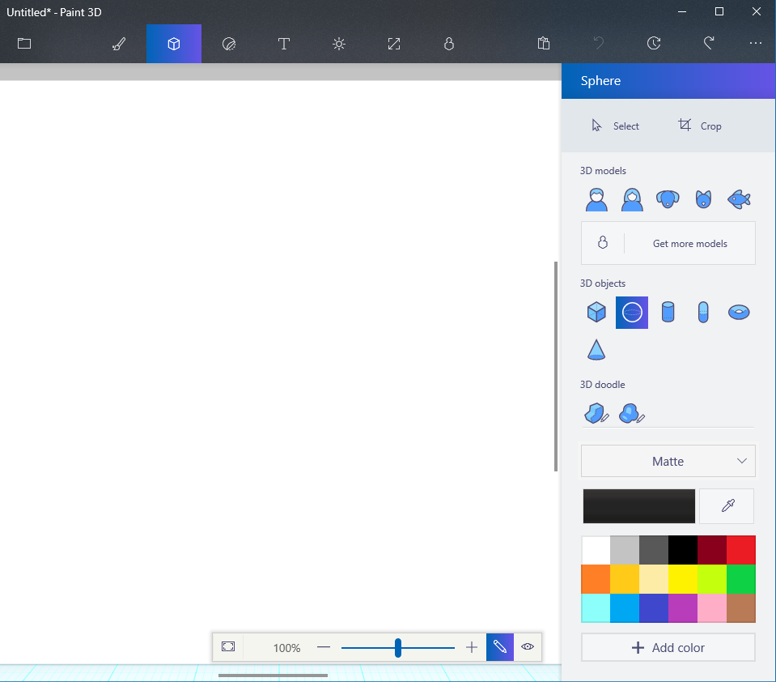
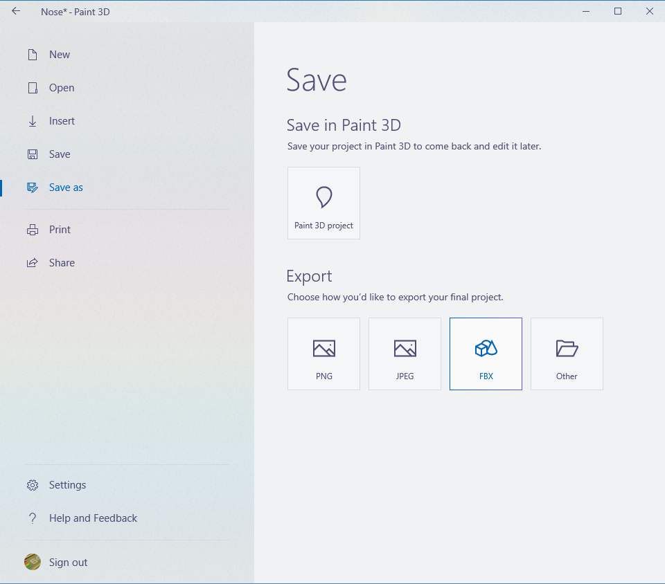

# Task 5.1.1 - Create the model in Paint3D

Creating a 3D model of our products will open up a world of opportunities. We can 3D print prototype noses, render them in 3D to visualize how they look, or even see them for ourselves in Virtual Reality!

3D Paint is a simple tool in the Windows 10 Creators Update that allows us to create and paint 3D models. Perfect for this task!

## Prerequisites 

This walkthrough assumes that you have:
* Windows 10 Creators Update
* Paint 3D

## Task

#### The Nose 3D model

The first part of this task is to create the Nose 3D model itself, with a base color.

1. Launch **Paint 3D** using the Windows Start Menu. If the Welcome Screen is displayed, dismiss it.
2. You will see a blank white scene when Paint 3D has launched. This is the canvas you will be working on to create your Knowzy nose prototype.
3. The top-center menu allows you to select what tools you want to use. The first one is Art Tools for paining and coloring, while the next (cube icon) is for acctually creating 3D objects. Select this menu tab.
    
4. In the 3D objects menu tab, select the Sphere tool (should be selected by default) by clicking the Sphere icon under 3D objects.
5. This allows you to draw a Sphere on the canvas. Before doing so, use the Color Selector below the tool to select what color you want the nose to have as a base. Note, by changing the dropdown above the color selector from Matte to Gloss will make the nose look shiny - play with this to get the nose YOU want to design!
6. Draw the Sphere on the canvas by placing the mouse pointer where you want it, left clicking and draging it to the size you want. You can force the size to be uniform by holding **SHIFT** while dragging. This is how our first prototype looked like:
    

#### Painting the Nose
The second task is to give the nose some details. This can be stickers, color variations and drawings.
1. Select the Art Tools tab to see what tools you have for drawing. 
> Note: For these steps, it is very important to not draw on the white canvas itself as it will make it a part of the 3D model itself.

2. You can now use any of the Art Tools to draw on the model itself. Feel free to be creative here! For our first prototype, we simply used the Caligraphy Tool with the Thickness set to 36px to draw to nose holes on the bottom of the nose.

    

3. The third menu tab is for placing Stickers on the model. Feel free to play around with the various tools to become familiar with the software - this allows you to be very creative when designing new protoypes for us!

#### Saving and Exporting
The last task here is to save the model, and export it as FBX to be used with Unity or BabylonJS (by converting to OBJ, see BabylonJS task).

1. Save the Project itself as a Paint 3D project by clicking the Folder icon on the top-left corner of the window, and give it a proper name.
2. Now, export the scene by clicking the same folder icon on the top-left corner of the window, and select FBX under Export:
    
    

3. Save it in a location you can remember for the tasks ahead.

Congratulations, you have now mastered Paint 3D and how to use it to create Nose Prototypes in 3D!

## References
The FBX export of our first Nose Prototype:
[Nose Prototype (FBX)](./Reference/NosePrototype.fbx)