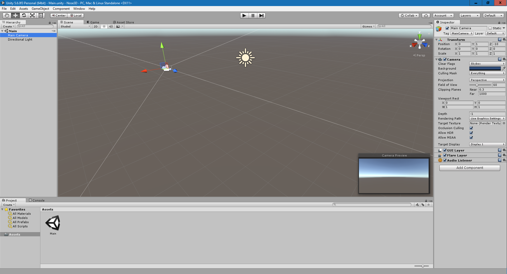
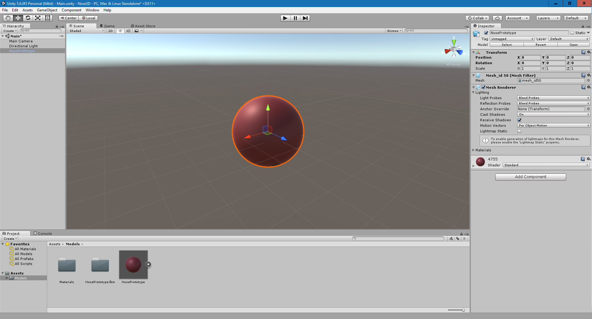
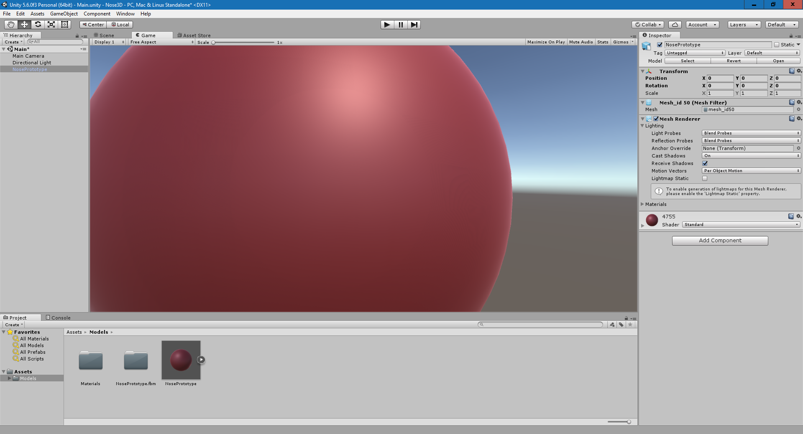
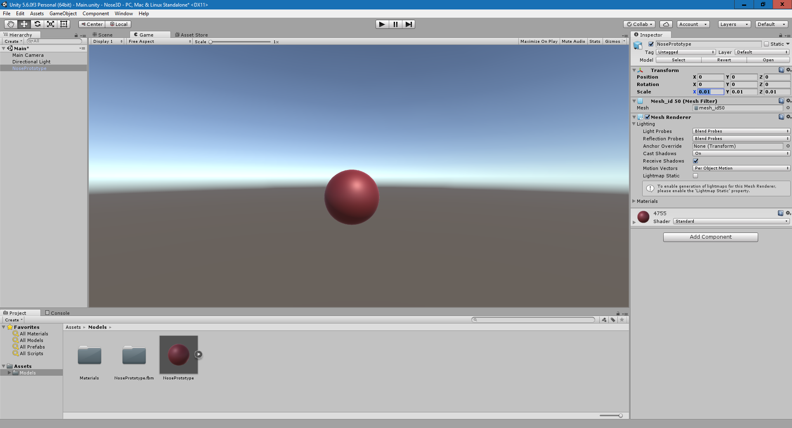
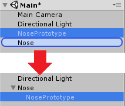
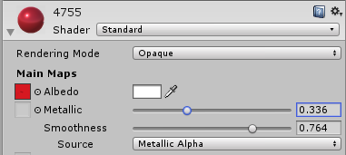
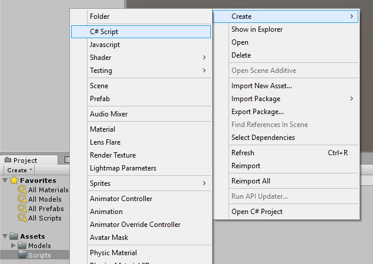

# Task 5.1.2a - Create a Unity solution to visualize 3D Model
Now that we have a proper 3D model of our nose prototype, we can start rendering it in real-time through a UWP app. To create the app, we use the Unity 3D rendering engine.
Unity 3D has built-in support for loading FBX, so all we need to do is to load the model, add it to a scene and export it as a UWP. This allows us to properly simulate how our prototypes looks in the real world!

## Prerequisites 

This walkthrough assumes that you have:
* Windows 10 Creators Update
* 3D Nose Model from Paint 5.1.1
* Unity 5.6 with UWP Plugin for exporting UWP

## Task 

#### Creating a new project
1. Launch Unity 3D using the Windows Start Menu. When the Unity 3D Project dialogue is visible, click NEW.
    > Note: If you launch if for the first time, log in with you free unity3d account.

2. In the Create New Project dialogue, give the project a proper name like "Nose3D", select the 3D toggle and where you want it before clicking [Create project].

    

3. Unity will spend a few seconds on generating the new project. When done, you will see a default blank Unity 3D project.
4. Let's save the empty scene first by using **CTRL+S** or **File->Save Scenes** and name it **Main.unity**. Save it directly in the new projects default Assets-folder.
5. Unity 3D is a complex 3D engine, and for rendering our 3D nose we have to touch some of the basics.

**The interface:**



The Unity 3D interface has 5 main parts. The big 3D view is your scene. There are a couple of tabs above this scene named Scene and Game. Scene is where you will be working, and the Game tab is where you can see what the Game looks like when you press Play.

The hierarchy is where you can see all objects currently in your scene. If your Main scene is collapsed, click the triangle to expand its content (just a normal tree-view). By default, the scene has a camera (what you see through in the Game tab), and a Directional Light (think of this as the sun).
This is where we will be adding our own objects to build up the scene. Each of these items is a GameObject.

The Project tab contains the entire projects file structure. Everything you work with needs to be in the default Assets folder. Inside this folder you are free to do everything you want to build up your own folder structure.

The Inspector tab contains all the properties of a selected GameObject. If you select the Main Camera GameObject from the Hierarchy, you can see all components and properties attached to this GameObject. This is the way objects are built in Unity, a combination of different components create and defines a GameObjects purpose.

The top menu is the normal Windows menu, with some tools for transforming GameObjects and configuring your scene view and UI layout.

####Loading the 3D Nose model
Next we will have to load the 3D nose model we created earlier.
1. Create a new folder in the project view from Unity by right-clicking and selecting **Create->Folder**. Name it **Models**.

    

2. Now locate the 3D Nose FBX model from where you saved it in 5.1.1 and copy it into the new Models folder using File Explorer.
3. Go back to Unity 3D. You will notice that it automatically detects a new file and imports it. You can find it in the Assets/Models folder in the project view:

    

4. Now drag the nose into the scene hierarchy (release it on the gray area) to place it in the scene.
5. You should see the Nose in the Hierarchy View, but it might not be visible in the scene view. Having the GameObject selected, hover the mouse over the scene view window and press **F** on the keyboard to focus on the object. You should now see it.
    
    

    Clicking the Game tab on top of the Scene view will let you see what the camera sees. In the end, we want to position it so it is visible by the camera.

    

6. There are some issues we need to solve:
    * The scale is different between Unity and Paint 3D, so the object we imported is very big.
    * The origo for the polygons in the 3D model got an offset from center of the GameObject.
    * The color is a bit dark
6. Solving the scale issue: Click on the NosePrototype to view the Position, Scale and Rotation properties. Set the scale to **0.01**

    

    I. Solving the origo issue: Create a new and empty GameObject in the scene by clicking the small button on the top-left side of the Hierarchy panel named Create and select **Create Empty**.

    

    A new GameObject item is visible in the Scene Hierarchy. Click it to view the properties. First, set the name to Nose, and set the all the Position fields to 0 to center the empty gameobject in the scene. You can focus it again using **F** with the mouse hovering the scene view in Scene mode (move out from Game if you didn't do this yet). You can then see the empty GameObject in the center of the scene, with the nose somewhere next to it.

    

    II. Select the Nose 3D model GameObject and use the axis handles to position it as close to the center as possible (drag the red and green handles using the mouse and left mouse button). It does not need to be 100% accurate but give it a good try.
    Tip: The handles are there so you can move the object along the selected axis. You can use the Grid and these handles to align them to the center. Look closely in the image below, the grid aligns with the axis handles:

    

    III. With the Nose model in the center, we need to use the Hierarchy View to make it a child of the new empty **Nose** GameObject. Drag the NosePrototype GameObject (it will be named the same as you 3D model FBX file name) and drop it on the Nose GameObject to make it a child.

    

    Having the Nose 3D model GameObject as a child to another will position it relative to the parent GameObject. This means that if we rotate or move it, it will follow.
8. Fixing the dark color issue: Each GameObject that got a visible surface like our Nose 3D model got a Material. A material is a descriptor on how the surface which the material is assigned to will look and behave. This includes color, texture assignment and light calculations. For those who are familiar with Graphics Programming, a Material is the Shader being used to render the polygons. To find the assigned material, you can either expand the Nose GameObject and select the 3D model GameObject (NosePrototype) and find the Material on it, or navigate to the Materials folder generated when importing the model and clicking it from the Project view.

    

    When we imported the object, it automatically generated a Material, set the texture to what we made in Paint 3D and assigned it to the model in Unity. The property that allows us to control the texture is the Albedo property under Main Maps on the Material. You can see the texture next to it in a miniature thumbnail. Next to this property you can see a gray color. This is multiplied with the texture, thus darkening it. Set this color to white to fix the dark coloring issues. Feel free to play around with the metallic and smoothness settings to give it a metallic or matte look based on your preference.

    

9. With the issues fixed, the color now looks more natural, the object has a better size and is centered.

    

    Verify that the camera in the Game view sees this too. This is what the user will see when they launch the app later. From this view, you can continue to modify the scale and position if needed. In my case, it now looks like this:

    

#### Making the nose rotate
To make this look less static, we will create a custom component using C# to make the nose rotate.
1. Under Assets, create a new folder named Scripts:

    

2. In the Scripts folder, right click and click **Create->C# script**. Name it **NoseRotator**

    

3. If the Nose GameObject is not collapsed, collapse it now. Then drag and drop the NoseRotator script on the Nose GameObject in the Hierarchy View to add it as a component to this object:

    

4. If you click on the Nose GameObject using the Hierarchy Panel, you can use the Inspector to see the component you added.

    

5. Double click the NoseRotator script in the Project view to edit the code. You can use the Unity Preferences (**Edit->Preferences**) to set what Editor you want to use. I set it up to use Visual Studio.
6. The script has two functions by default, Start() and Update(). Start is called once when the app launches, and Update() is called every frame.
Since we will animate this nose, we want to rotate it slightly every time Update is called. In Update(), add the following line:

    ```csharp
		transform.Rotate(Time.deltaTime * Vector3.up * speed);
    ```

    Also, add a new public floating point variable called speed to the class, just above Start(). The complete listing should look like this:
    ```csharp
    using System.Collections;
    using System.Collections.Generic;
    using UnityEngine;

    public class NoseRotator : MonoBehaviour {
        public float speed = 50.0f;
        
        // Use this for initialization
        void Start () {
            
        }
        
        // Update is called once per frame
        void Update () {
            transform.Rotate(Time.deltaTime * Vector3.up * speed);
        }
    }
    ```
    The Rotate function is rotating the GameObject this script is attached to. Time.deltaTime is the amount of time since last frame, so it can be used to sync the timing with the clock. Vector3.up is really just a Vector: 0,1,0. This is used to rotate only around the Y axis, and speed is how fast it will rotate. Since we multiply this with Time.deltaTime, speed will control how many degrees it will rotate pr. second.

    Save the code and go back to Unity.

7. **Testing the app**: Before exporting this as a UWP, we need to ensure the app is working. Click the Play button on top of the scene to automatically enter the Game tab, and start running the code. You should now see the nose rotating in the center of the screen. It might have some offset to it based on how accurate you were when centering it earlier.
    

    > Tip: With the Nose GameObject selected, you can see the speed variable visible, and set to 50. Since we made the speed variable public, you can directly set the variable inside the editor instead of changing the script.

#### Exporting as UWP
The final step is to export our fresh Nose 3D visualizer app as a UWP so we can distribute it. This is very simple using Unity.
1. To export, go to the Build Settings of the project by using **File->Build Settings**. A new popup will show. A large empty gray area is visible named Scene in Build. Click the button below it named **Add Open Scene** to add our scene **Main** to the list.
2. Select Windows Store and click Build to export:

    

    Export it to a new folder somewhere on your PC and press OK to start exporting the project. This will take a minute.
3. When the export is done, the folder will open in File Explorer. Open the Nose3D.sln solution in Visual Studio.
4. Change the Build Configuration to **Master** and **x64** and build, deploy and run the project.


5. The project should now build (it might take a few minutes) and run. You should see the rotating 3D nose in the center of the app.

Congratulations, you have now created a 3D Nose visualizer UWP app using Unity! Since this is now a valid Windows Store app, you can now find the app from the Windows Start Menu.


## References
