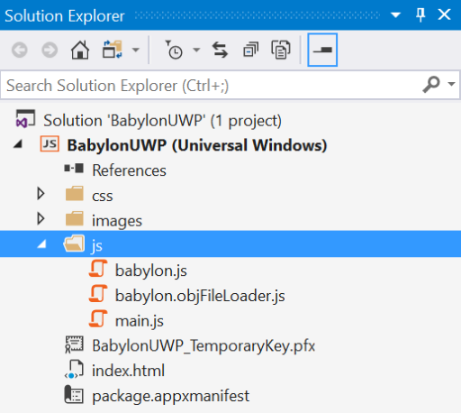

# Task 5.1.2b - Create a BabylonJS solution to visualize 3D Model

Now that we have a proper 3D model of our nose prototype, we can start rendering it in real-time through a Javascript UWP app. To create the app, we will use the Visual Studio 2017 Javascript UWP template. To load and render our model, we will use Babylon JS, which is a WebGL-based 3D engine.

Because Babylon does not support FBX, we first need to convert our FBX file to a Bablylon-supported format (babylon, glTF, or OBJ).

## Prerequisites

This walkthrough assumes that you have:

* Windows 10 Creators Update
* 3D Nose Model from Paint 5.1.1
* Visual Studio 2017 with the Universal Windows Platform Development Workload to create a Javascript UWP app

## Task 

#### Convert the model to OBJ

To convert the model, we will use the online FBX to OBJ converter, using the FBX we exported in 5.1.1.
1. Go to: [Online Model Converter](http://www.greentoken.de/onlineconv/)
2. Follow the steps in the tool to convert the FBX to OBJ, and download the OBJ file. The MTL file is not needed.

One problem with the conversion is that we don't get the texture. However, you can use any PNG file for this. For the steps below, create a new image in any paint program and fill it with red color to use as the texture. 

#### Creating a new project

1. Launch Visual Studio 2017 and then select File | New | Project.
    > Note: If you are launching Visual Studio for the first time, log in with your Microsoft account.

2. In the Templates section of the New Project window, select Javascript | Windows Universal | Blank App (Universal Windows). Name the project "BabylonUWP".

    

3. Click OK to create your project. 

    > Note: You may be asked to turn on the developer mode in the Windows settings in order to create the project.

4. Launch the app by pressing F5 (for debug mode) or Ctrl+F5 (for normal mode). It should appear with a white page containing the text "Content goes here!".

    

#### Adding Babylon JS as a dependency

It is now time to add content to our app.

1. Add babylon.js to your project to enable it to work offline. In Solution Explorer, right-click the *js* folder and select **Add | Existing Item**. Then paste ```https://preview.babylonjs.com/babylon.js```) into the *File name* box and click **Add**. 

    

2. Add the babylon.js OBJ Loader dependency to your project to enable it to work offline. As in the previous step, add an existing item to the js folder and use ```https://preview.babylonjs.com/loaders/babylon.objFileLoader.js``` as the file name.

3. The solution folder should now look like this:

    

4. It is now time to integrate those files into the application. Open the ```index.html``` file and add the two following script references *before* the main.js one:

        <!DOCTYPE html>
        <html>
        <head>
            <meta charset="utf-8" />
            <title>BabylonUWP</title>
            <link href="css/default.css" rel="stylesheet" />
        </head>
        <body>
            <div>Content goes here!</div>

            <script src="js/babylon.js"></script>
            <script src="js/babylon.objFileLoader.js"></script>
            <script src="js/main.js"></script>
        </body>
        </html>

5. You can now launch by pressing F5 to ensure that the setup is correct. No error should appear in the JavaScript console.

#### Create your first scene

Now that the project is ready, we can create our first 3D scene as explained in the [Basic Tutorial](https://doc.babylonjs.com/tutorials/creating_a_basic_scene) for Babylon JS.

1. Replace the ```div``` element containing the text "Content goes here!" with a canvas enabling WebGL rendering in HTML.

```<canvas id="renderCanvas"></canvas>```.

2. The ```index.html``` file should now look like this:

        <!DOCTYPE html>
        <html>
        <head>
            <meta charset="utf-8" />
            <title>BabylonUWP</title>
            <link href="css/default.css" rel="stylesheet" />
        </head>
        <body>
            <canvas id="renderCanvas"></canvas>

            <script src="js/babylon.js"></script>
            <script src="js/babylon.objFileLoader.js"></script>
            <script src="js/main.js"></script>
        </body>
        </html>

3. To ensure that the canvas is rendered in full screen, replace the contents of the file ```css/default.css``` with the following:

        html, body {
            overflow: hidden;
            width: 100%;
            height: 100%;
            margin: 0;
            padding: 0;
        }

        #renderCanvas {
            width: 100%;
            height: 100%;
            touch-action: none;
        }

4. Open the ```js/main.js``` file and replace its content with the following:

        // Get the canvas element from our HTML above
        var canvas = document.getElementById("renderCanvas");

        // Load the BABYLON 3D engine
        var engine = new BABYLON.Engine(canvas, true);

        // Now create a basic Babylon Scene object
        var scene = new BABYLON.Scene(engine);

        // Let's try our built-in 'box' shape. Params: name, size.
        var box1 = BABYLON.Mesh.CreateBox("box1", 1);

        // Creates a default light and camera.
        scene.createDefaultCameraOrLight(true);

        // This attaches the input camera controls to the canvas
        scene.activeCamera.attachControl(canvas, false);

        // Register a render loop to repeatedly render the scene
        engine.runRenderLoop(function () {
            scene.render();
        });

5. You can now launch the project to see a cube in 3D. You can rotate the camera by dragging while pressing the left mouse button. You can control the zoom level with the mouse wheel.

    

#### Loading the 3D Nose model

1. Create a folder named ```assets``` at the root of the solution and copy your red-nose OBJ file into this folder.

2. Next, load the model by replacing the contents of the ```js/main.js``` file with the following:

        // Get the canvas element from our HTML above
        var canvas = document.getElementById("renderCanvas");

        // Load the BABYLON 3D engine
        var engine = new BABYLON.Engine(canvas, true);

        // Now create a basic Babylon Scene object
        var scene = new BABYLON.Scene(engine);

        // Let's load the red nose model.
        BABYLON.SceneLoader.ImportMesh(null, "assets/", "redNose.obj", scene, function (meshes) {
            // Keeps track of our model root.
            var redNoseModel = meshes[0];

            // Creates a default light and camera.
            scene.createDefaultCameraOrLight(true);

            // This attaches the input camera controls to the canvas
            scene.activeCamera.attachControl(canvas, false);

            // Register a render loop to repeatedly render the scene
            engine.runRenderLoop(function () {
                scene.render();
            });
        });

5. Launch the project to see red nose model displayed in the app.

#### Making the nose rotate

We will now animate the nose model.

1. Replace the contents of the ```main.js``` file with the following code:

    > Note: This codes demonstrates the animation system but you could rely upon the manual animation as well: [Animation Tutorial](https://doc.babylonjs.com/tutorials/animations).

        // Get the canvas element from our HTML above
        var canvas = document.getElementById("renderCanvas");

        // Load the BABYLON 3D engine
        var engine = new BABYLON.Engine(canvas, true);

        // Now create a basic Babylon Scene object
        var scene = new BABYLON.Scene(engine);

        // Let's load the red nose model.
        BABYLON.SceneLoader.ImportMesh(null, "assets/", "redNose.obj", scene, function (meshes) {
            // Keeps track of our model root.
            var redNoseModel = meshes[0];

            // Creates a default light and camera.
            scene.createDefaultCameraOrLight(true);

            // This attaches the input camera controls to the canvas
            scene.activeCamera.attachControl(canvas, false);

            // Create a rotation animation at 30 FPS
            var animation = new BABYLON.Animation("rotationAnimation", "rotation.y", 30, BABYLON.Animation.ANIMATIONTYPE_FLOAT, BABYLON.Animation.ANIMATIONLOOPMODE_CYCLE);

            // Add the animation key frames.
            var keys = [];
            // At the animation key 0, the value of rotation is "0"
            keys.push({
                frame: 30 * 0,
                value: 0
            });

            // At the animation key at 1 second, the value of scaling is a quarter of turn
            keys.push({
                frame: 30 * 1,
                value: Math.PI / 2
            });

            // At the animation key at 2 seconds, the value of scaling is a half of turn
            keys.push({
                frame: 30 * 2,
                value: Math.PI
            });

            // At the animation key at 3 seconds, the value of scaling is 3 quarter of turn
            keys.push({
                frame: 30 * 3,
                value: Math.PI / 2 * 3
            });

            // At the animation key at 4 seconds, the value of scaling is a full turn
            keys.push({
                frame: 30 * 4,
                value: Math.PI * 2
            });

            // Adding keys to the animation object
            animation.setKeys(keys);

            // Then add the animation object to redNoseModel
            redNoseModel.animations.push(animation);

            // Finally, launch animations on box1, from key 0 to key 60 * 4 with loop activated
            scene.beginAnimation(redNoseModel, 0, 60 * 4, true);

            // Register a render loop to repeatedly render the scene
            engine.runRenderLoop(function () {
                scene.render();
            });
        });

## References

1. [Babylon JS Documentation](https://doc.babylonjs.com/)

## continue to [next task >> ](521_MR.md)
