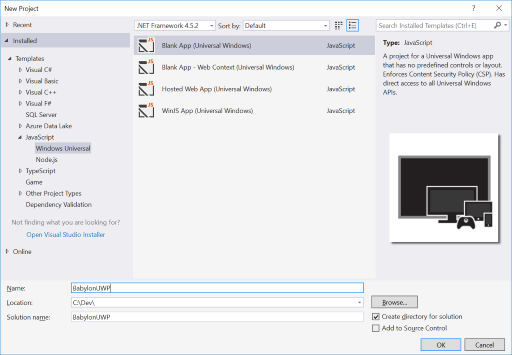
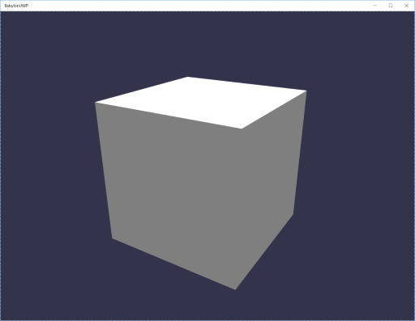

# Task 5.1.2b - Create a BabylonJS solution to visualize 3D Model
Now that we have a proper 3D model of our nose prototype, we can start rendering it in real-time through a Javascript UWP application. To create the application, we use the Visual Studio 2017 Javasctipt UWP template.

In order to load and render our model, we will rely on Babylon JS which is a WebGL based 3d engine.

As Babylon does not support natively loading FBX, we will first need to convert our FBX file to a Bablylon supported format (babylon, GlTF or OBJ).

## Prerequisites
This walkthrough assumes that you have:
* Windows 10 Creators Update
* 3D Nose Model from Paint 5.1.1
* Visual Studio 2017 with the Universal Windows Platform Development Workload to create a Javascript UWP

## Task 

#### Convert the model to OBJ

To convert the model, we will use the online FBX to OBJ converter, using the FBX we exported in 5.1.1.
1. Go to: [Online Model Converter](http://www.greentoken.de/onlineconv/)
2. Follow the steps in the tool to convert the FBX to OBJ, and download the OBJ file. The MTL file is not needed.
3. The problem here is that we don't have the texture, but you can use any png file, just create a new file in pain with a red color and use it through these steps.

#### Creating a new project
1. Launch Visual Studio 2017 using the Windows Start Menu. Once open, click File>New>Project...
    > Note: If you launch if for the first time, log in with your MSA account.

2. In the "Create New Project" dialog under template, select Javascript>Windows Universal>Blank App, and give the project a proper name like "BabylonUWP".

    

3. Click Ok to create your project.
    > Note: You may be asked to turn on the developer mode in the Windows settings in order to create the UWP.

4. Your project is now ready and it can easily be launched by pressing F5 (for debug mode) or Ctrl+F5 (for normal mode). You should see an application running with a white page containing the text: "Content goes here!".

    

#### Adding Babylon JS dependency
It is now time to add content in our UWP.

1. Add the Babylon.JS dependency to your project (this allows your project to work offline). Right click on the *js* folder, click on **Add -> Existing Item...**. Copy this link to your clipboard (```https://preview.babylonjs.com/babylon.js```) and paste it in the *File name* box. Click **Add**. 

    

2. Add the Babylon.JS OBJ Loader dependency to your project (this allows your project to work offline). Similar to the previous step, use this link to add the file to the js folder (```https://preview.babylonjs.com/loaders/babylon.objFileLoader.js```)

3. The solution folder should now look like this:

    

4. It is now time to integrate those files in the application. Open the ```index.html``` file and add the two following script references *before* the main.js one:

```html
<!DOCTYPE html>
<html>
<head>
    <meta charset="utf-8" />
    <title>BabylonUWP</title>
    <link href="css/default.css" rel="stylesheet" />
</head>
<body>
    <div>Content goes here!</div>

    <script src="js/babylon.js"></script>
    <script src="js/babylon.objFileLoader.js"></script>
    <script src="js/main.js"></script>
</body>
</html>
```

5. The project can now be launched in debug by pressing F5 to ensure that the setup is correct. No error should be displayed in the javascript console.

#### Create your first scene
As the project is ready, we can now create our first 3D scene as explained in the [Basic Tutorial](https://doc.babylonjs.com/tutorials/creating_a_basic_scene) of Babylon JS.

1. The ```div``` element containing the text: "Content goes here!" needs to be replaced by a canvas enabling WebGL rendering in Html. Open the ```index.html``` and replace ```<div>Content goes here!</div>``` by ```<canvas id="renderCanvas"></canvas>```.

2. The ```index.html``` file should look like this:

```html
<!DOCTYPE html>
<html>
<head>
    <meta charset="utf-8" />
    <title>BabylonUWP</title>
    <link href="css/default.css" rel="stylesheet" />
</head>
<body>
    <canvas id="renderCanvas"></canvas>

    <script src="js/babylon.js"></script>
    <script src="js/babylon.objFileLoader.js"></script>
    <script src="js/main.js"></script>
</body>
</html>
```

3. To ensure that the canvas is rendered in full screen, replace the content of the file ```css/default.css``` by the following one:

```css
html, body {
    overflow: hidden;
    width: 100%;
    height: 100%;
    margin: 0;
    padding: 0;
}

#renderCanvas {
    width: 100%;
    height: 100%;
    touch-action: none;
}
```

4. The setup being done, open the ```js/main.js``` file and replace its content by the following:

```javascript
// Get the canvas element from our HTML above
var canvas = document.getElementById("renderCanvas");

// Load the BABYLON 3D engine
var engine = new BABYLON.Engine(canvas, true);

// Now create a basic Babylon Scene object
var scene = new BABYLON.Scene(engine);

// Let's try our built-in 'box' shape. Params: name, size.
var box1 = BABYLON.Mesh.CreateBox("box1", 1);

// Creates a default light and camera.
scene.createDefaultCameraOrLight(true);

// This attaches the input camera controls to the canvas
scene.activeCamera.attachControl(canvas, false);

// Register a render loop to repeatedly render the scene
engine.runRenderLoop(function () {
    scene.render();
});
```

5. The project can now be launched and displays a cube in 3D !!! The camera can rotate by holding the mouse left click on the application. The zoom level is controlled by the mouse wheel.

    

#### Loading the 3D Nose model

1. Create a folder named ```assets``` at the root of the solution and copy your ```redNose.obj``` file in this folder.

2. Instead of creating a sphere, the model needs to be loaded. The content of the ```js/main.js``` file needs to be updated to:

```javascript
// Get the canvas element from our HTML above
var canvas = document.getElementById("renderCanvas");

// Load the BABYLON 3D engine
var engine = new BABYLON.Engine(canvas, true);

// Now create a basic Babylon Scene object
var scene = new BABYLON.Scene(engine);

// Let's load the red nose model.
BABYLON.SceneLoader.ImportMesh(null, "assets/", "redNose.obj", scene, function (meshes) {
    // Keeps track of our model root.
    var redNoseModel = meshes[0];

    // Creates a default light and camera.
    scene.createDefaultCameraOrLight(true);

    // This attaches the input camera controls to the canvas
    scene.activeCamera.attachControl(canvas, false);

    // Register a render loop to repeatedly render the scene
    engine.runRenderLoop(function () {
        scene.render();
    });
});
```

5. By launching the project now,  we can see a beautiful red nose model displayed in a Javascript UWP application.

#### Making the nose rotate
To make this look less static, we will animate the model.

1. The main.js needs to be adapted to integrate the new animation code:
    > Note: This codes demonstrates the animation system but you could rely upon the manual animation as well: [Animation Tutorial](https://doc.babylonjs.com/tutorials/animations).

```javascript
// Get the canvas element from our HTML above
var canvas = document.getElementById("renderCanvas");

// Load the BABYLON 3D engine
var engine = new BABYLON.Engine(canvas, true);

// Now create a basic Babylon Scene object
var scene = new BABYLON.Scene(engine);

// Let's load the red nose model.
BABYLON.SceneLoader.ImportMesh(null, "assets/", "redNose.obj", scene, function (meshes) {
    // Keeps track of our model root.
    var redNoseModel = meshes[0];

    // Creates a default light and camera.
    scene.createDefaultCameraOrLight(true);

    // This attaches the input camera controls to the canvas
    scene.activeCamera.attachControl(canvas, false);

    // Create a rotation animation at 30 FPS
    var animation = new BABYLON.Animation("rotationAnimation", "rotation.y", 30, BABYLON.Animation.ANIMATIONTYPE_FLOAT, BABYLON.Animation.ANIMATIONLOOPMODE_CYCLE);

    // Add the animation key frames.
    var keys = [];
    // At the animation key 0, the value of rotation is "0"
    keys.push({
        frame: 30 * 0,
        value: 0
    });

    // At the animation key at 1 second, the value of scaling is a quarter of turn
    keys.push({
        frame: 30 * 1,
        value: Math.PI / 2
    });

    // At the animation key at 2 seconds, the value of scaling is a half of turn
    keys.push({
        frame: 30 * 2,
        value: Math.PI
    });

    // At the animation key at 3 seconds, the value of scaling is 3 quarter of turn
    keys.push({
        frame: 30 * 3,
        value: Math.PI / 2 * 3
    });

    // At the animation key at 4 seconds, the value of scaling is a full turn
    keys.push({
        frame: 30 * 4,
        value: Math.PI * 2
    });

    // Adding keys to the animation object
    animation.setKeys(keys);

    // Then add the animation object to redNoseModel
    redNoseModel.animations.push(animation);

    // Finally, launch animations on box1, from key 0 to key 60 * 4 with loop activated
    scene.beginAnimation(redNoseModel, 0, 60 * 4, true);

    // Register a render loop to repeatedly render the scene
    engine.runRenderLoop(function () {
        scene.render();
    });
});
```

## References
1. [Babylon JS Documentation](https://doc.babylonjs.com/)

## continue to [next task >> ](521_MR.md)
